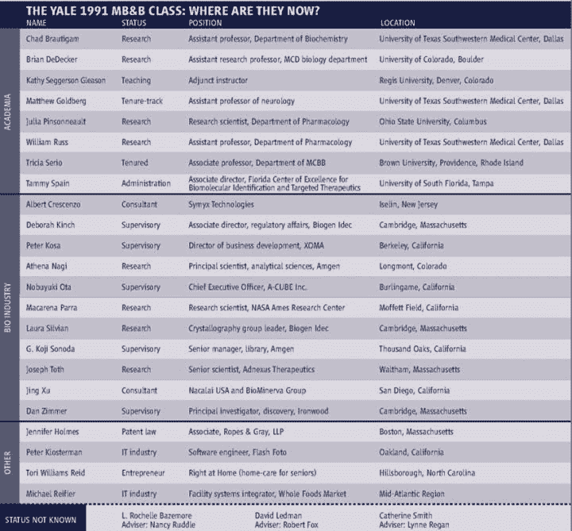
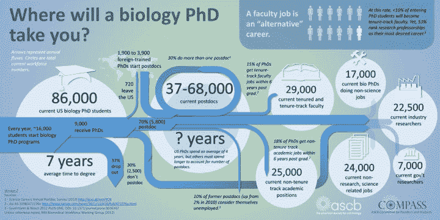
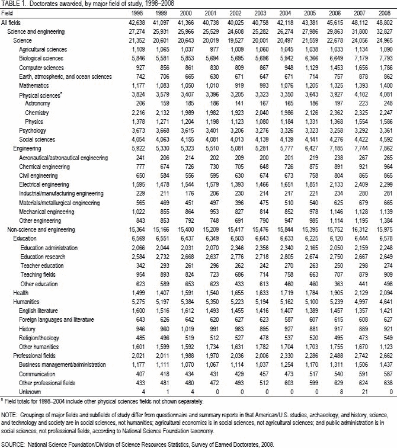
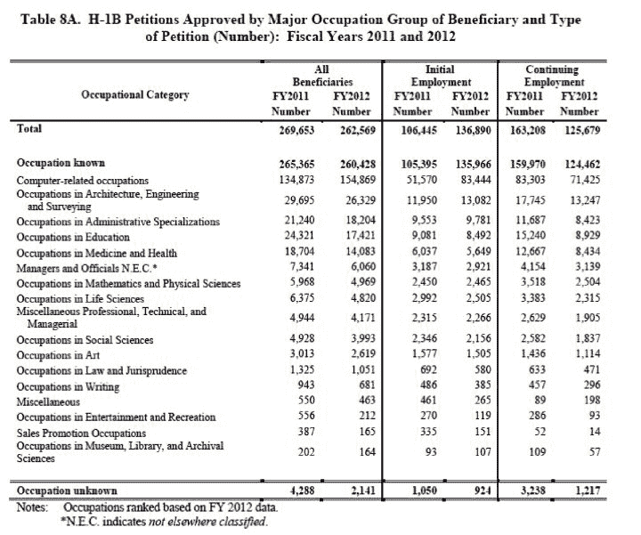

# 现在学生物出路真有那么不济吗？（@Mengjie Chen）

> 作者：[Mengjie Chen](https://www.zhihu.com/question/28347460/answer/41411431)
> 
> 我要拿出压箱底的劝退贴。 Mengjie Chen耶鲁生物博士，现在北美已经拿到tenure，比千老不知道高到哪里去了，算是站在生物行业顶尖的人。你看看他什么态度。我觉得没有比这个更有说服力的了。

议论完了，观点已经很明确了，我来抒发个感情。

我不知道你们看不看历史，个人哪，从来都无法抵抗时代。现在培养过剩的生物专业phd都是时代的悲剧，按照错的服务器信息加错了技能点，组队的时候发现不需要这么多生物的，号练废了，这个是要面对的事实。人也无法抵抗命运，但是人生还长，命运才刚刚展开，你不试怎么知道，你的命是不是通过转专业过上幸福快乐的生活呢。什么叫顺应时代，就是加这个时代真正需要的技能点。想找什么工作，就去linkedin搜相关的职位要求，一个一个学。最好是交叉学科，能用上你所学的。coding的位置多，你就开始码，这就是供求关系，没啥议论的。

什么样的人可以义无反顾的退呢？自认为是学术水平50%以下的赶紧走。我觉得过剩了至少50％，听我解释：健康时期的NIH funding rate是20～30%，中一个grant可以维持5年，一个lab五年中一次就可以持续运转，按照20% funding rate是可以实现的，没有人需要quit，大不了千老呗。但是现在funding rate 低于10%，10年中一个，一半的lab运转不下去了，千老都不好找了。

觉得自己前途渺茫，对科研失去兴趣的人，在实验室没有安全感，象做奴隶一样的，也赶紧走。命运虽然不公平，但每个人都应该有权利过有尊严的生活。极品老板不值得卖命。

不要觉得浪费了1～2年青春，很可惜。你三十多岁的时候回过头来，会发现下狠心走很值得（我还小，别管我怎么知道的）。我这转行成功的hedge fund百万哥，金融白富美，众多小码农，我都不好意思描述他们脱离苦海以后过的有多爽。

还有就是念了好几年phd都不知道自己的领域是过热还是过冷，不知道前沿在哪，自己的project能不能转化，好不好拿funding的糊涂蛋们，你们这个搜集信息的水平基本也就告别科研了。

对于个别问职业规划的，我就不回答了，我只提供统计数据，自己的路自己选择。

生物科研有非常大的迷惑性，门槛低，招生量是别的学科的五倍，但做好了门槛奇高。你看生物前沿的大PI们，一个个数理化背景好的不得了，不念个harvard physics/ mit math或是马普 cybernetics的phd都不好意思出道， 这背景恰恰是生物系的学生没有的，这个我也分析得很清楚了。

千万不要觉得科研的发展少了你们，会有什么停滞。你们要救的是你们自己。少了张院士是个损失，少了你们的negative result就是科研少走的弯路。按照未来教育部长所说，名校的学生有不同的历史使命，他们应该科学精神至上，不应该考虑就业，要靠这些人推动科学进步，我觉得特别有道理。但是对于三本的学生，也就是第三名及以后的本科学生，我觉得做人最重要的还是开心。

还有下次碰到cs的人抱怨不好找工作，别理他，直接咬他。

我是认真的，像这样咬：

* * *

既然火了就澄清一下观点。

生物的本科生，研究生，博士的过剩是结构性的。换句话说，就是你失业跟你能力关系不大，只是因为，一没有对口的职位，二没有多余的跟专业无关的职位。

这个过剩严重到什么程度呢？

国内情况不熟悉，美国的很熟悉，因为我也要申funding，对这个很关注。

NCI的头，诺贝尔奖获得者 Harold Varmus 前几天刚辞职，[Harold Varmus to resign as head of US cancer institute : Nature News & Comment](https://link.zhihu.com/?target=http%3A//www.nature.com/news/harold-varmus-to-resign-as-head-of-us-cancer-institute-1.17063)， 他就是我分享的劝退文章的作者，[Rescuing US biomedical research from its systemic flaws](https://link.zhihu.com/?target=http%3A//www.pnas.org/content/111/16/5773.full)。 他表示，除了translational和clinical的研究项目，基础研究的项目要大规模缩减。

NIH也发通告说要全面缩减funding了，这是今天最新的报道：

[Congrats Young Scientists, You Face The Worst Research Funding In 50 Years](https://link.zhihu.com/?target=http%3A//www.huffingtonpost.com/2015/03/03/francis-colliins-nih-funding_n_6795900.html)

现在的funding rate是10%，什么意思呢，100个PI写的proposal，只有10个会得到资金支持。

假设机会均等，写10个才会中一个。但其实机会不均等，无法转化和上临床的项目，希望非常渺茫。

如果你的方向是冷门的基础研究，找退路。。。

* * *

补充一些内容，

1.  我班长提醒我卖药的工作也很难找，卖药的也不多。我脑补其实卖药是个肥职，应该不好找。

2.  多好的学校多好的program可以打住，这个不太好一梆子打死，一是方向太多，二是好学校的人比较敏感。

这样吧，自黑。

2008年的science上统计了1991年入学的Yale MBB的学生出路，但是班里26个人读研20后找到教职的只有2个人。

原文要自己搜下

NEWS FOCUS

SCIENCE EDUCATION

And Then There Was One

1\. [Jeffrey Mervis](https://link.zhihu.com/?target=http%3A//www.sciencemag.org/search%3Fauthor1%3DJeffrey%2BMervis%26sortspec%3Ddate%26submit%3DSubmit)

A decade after 26 members of the entering class of 1991 earned their Ph.D.s from Yale’s elite molecular biophysics and biochemistry program, only one holds a tenured faculty position. But is an exodus from academia a bad thing?

这里有被炸出来的其他program的人回忆各班的情况：

[https://bluelabcoats.wordpress.com/2008/09/23/and-then-there-was-one/](https://link.zhihu.com/?target=https%3A//bluelabcoats.wordpress.com/2008/09/23/and-then-there-was-one/)

过来人他不骗你，不要再挣扎了。

3\. 转计算转码工是市场决定的，显然不是唯一的路。但一年有20万h1b，可以消化掉很多转专业的人。你问问你们学校，你们系的学长学姐，还有什么可能性。但一定要努力寻找其他的出路。

4\. 汇总下nature, PNAS上劝退文，自己看吧：

Fix the PhD Nature 472, 259–260 (21 April 2011)

[Fix the PhD : Nature : Nature Publishing Group](https://link.zhihu.com/?target=http%3A//www.nature.com/nature/journal/v472/n7343/full/472259b.html)

Life outside the lab: The ones who got away 03 September 2014

[Life outside the lab: The ones who got away : Nature News & Comment](https://link.zhihu.com/?target=http%3A//www.nature.com/news/life-outside-the-lab-the-ones-who-got-away-1.15802)

There is life after academia 03 September 2014

[There is life after academia : Nature News & Comment](https://link.zhihu.com/?target=http%3A//www.nature.com/news/there-is-life-after-academia-1.15808)

Education: The PhD factory Nature 472, 276-279 (2011)

[Education: The PhD factory : Nature News](https://link.zhihu.com/?target=http%3A//www.nature.com/news/2011/110420/full/472276a.html)

Rescuing US biomedical research from its systemic flaws March 18, 2014

[Rescuing US biomedical research from its systemic flaws](https://link.zhihu.com/?target=http%3A//www.pnas.org/content/111/16/5773.full)

本来就没啥位置，还有严重性别歧视的问题

Elite male faculty in the life sciences employ fewer women

[http://wwwhttp://www.pnas.org/content/111/28/10107.abstract](https://link.zhihu.com/?target=http%3A//www.pnas.org/content/111/28/10107.full.pdf)

媒体报道：

[Too Few University Jobs For America’s Young Scientists : Shots](https://link.zhihu.com/?target=http%3A//www.npr.org/blogs/health/2014/09/16/343539024/too-few-university-jobs-for-americas-young-scientists%3Futm_campaign%3Dstoryshare%26utm_source%3Dfacebook.com%26utm_medium%3Dsocial)

总之，你行你上，不行早退。

我知道你们曾经都很优秀，但是时候要重新定位了。

明知没路还要往下走的，这就是你：

* * *

炸出万年潜水员。打算把我的劝退范围从校内扩大到知乎。

看到有人举我的例子，你看不出我转专业了么，你这不是坑人么，生物统计跟生物没有关系，你拿个type 1 error出来灌鸡汤没有意义。我是七弯八拐的当了教授，但我基础比本科数学的差了不知道多少，注定是个吊车尾的教授，经常被科班(或是名校，lol)出身的人歧视的要死，这没啥值得参考和羡慕的。

各位生物专业本科生，除非有特殊兴趣，早转止损。

各位在读phd，除非有特殊技能，除非是名校明星，考虑别的出路。

我渣科生科院是偏工科的，但哪怕是bme，学过模电数电信号，用人单位看到生物两字也就直接pass了，再别说你武大的基础科学了，根本没有啥对口的单位。

我本科直接工作的同学大都是去卖药了，出国深造的同学大多的quit了，有直接申cs或是ee phd的，有念bme然后找码工工作的，有中途quit念cs或是biostat master的，也都费了半天劲过上了正常人的生活。他们很多曾经都抑郁过，因为看不到前途。

你要是属于出不了国，本科毕业拿不到大pharm／咨询的offer，又不喜欢科研的普通孩子，你折腾这个生物专业干啥？去中科院搬砖也要年级前几名吧。

不知道你是几年级，我都建议你转系，哪怕你晚个一二年毕业。

我曾在校内上统计过大陆出身的sloan fellow教育背景，发现生物专业的其实不太适合搞生物科研，大陆的生物教育是很成问题的。现在贴过来，一家之言，你们自己判断：

数据来自2010-2014 Alfred Sloan Research Fellowship，这奖是给phd毕业六年内的北美学术明星的。

*   Chemistry (9)
*   2014 Junrong Zheng Rice
*   2013 Wen Li WSU
*   2013 Wei Min Columbia
*   2013 Wei Zhang UCB
*   2012 Bo Zhang UW
*   2011 Xiaosong Li UW
*   2011 Jiaxing Huang Northwestern
*   2010 Yu Huang UCLA
*   2010 Yi Cui Stanford
*   CS (7)
*   2014 Shan Lu UW-madison
*   2014 Elaine Shi Maryland
*   2013 Fei Sha USC
*   2012 Xi Chen Columbia
*   2012 Junfeng Yang Columbia
*   2011 Jinyang Li NYU
*   2010 Li Zhang UW-madison
*   Math (9)
*   2014 Song Sun Stony Brook
*   2014 Jun Yin UW-madison
*   2013 Jianfeng Lu Duke
*   2013 Wei Zhang Columbia
*   2012 Tong Liu Purdue
*   2012 Yi Ni Caltech
*   2011 Xiaoqing Li SUNY-B
*   2011 Dapeng Zhan MSU
*   2010 Xiaoyi Zhang Iowa
*   Computational, Evolutionary Molecular Bio (4)
*   2013 Yi Xing ULCA
*   2012 Jinbo Xu TTI
*   2012 Sheng Zhong UIUC
*   2010 Xinshu Xiao UCLA
*   Neuro (4)
*   2014 Liang Feng stanford
*   2012 Xinnan Wang stanford
*   2011 Xue Han Boston
*   2010 He Cui Medical College of Georgia
*   Physics (9)
*   2013 Liang Jiang Yale
*   2013 Jing Xia UCI
*   2013 Xi Yin Havard
*   2013 Zheng Wang TAMU
*   2013 Jiangfeng Zhou South Florida
*   2012 Ying Ran Boston College
*   2011 Shina Tan GIT
*   2011 Cenke Xu UCSB
*   2010 Xiaoliang Qi Stanford

手工统计的，可能有疏漏。从这个单子，我们看出物理化学数学入围者都是差不多的，比较稳定。进化分子生物和神经的人不多。这两个方向是生物科研的热门和主流方向之二，但在中国大部分大学的生物本科教育里不会涉及，也没有为该方向的深造做好准备。当然我没有考虑各科出国的总人数的问题，印象中基础学科里面，生物出国的最多，至少俺们学校phd新生中学生物的最多。

来看下进化分子方向获奖者的教育背景：

2012 Jinbo Xu TTI 本科是学数学的，后来学了计算机；2013 Yi Xing ULCA 本科生物＋计算机，在stanford统计系做的postdoc；2012 Sheng Zhong UIUC 本科数学和经济的；2010 Xinshu Xiao UCLA本科是精密仪器的。

神经方向的教育背景：

2010 He Cui Medical College of Georgia 是物理的本科，2012 Xinnan Wang stanford没查到，其余二人是生物或是生物物理背景的。

当然高大上的生物科研还有其他很多热门方向，我们来看下大陆生物本科能不能接轨。数据来自2011公布的总统奖（PECASE），也是发给ap的，跟生物相关的主要是健康部门。其实2012， 2013的也出来，我懒得查了。

健康部门按照字母顺序一个一个说过去吧：

*   Dr. Rommie E. Amaro, University of California, Irvine， 化学工程手段做给药系统的
*   Dr. Sonja M. Best, National Institute of Allergy and Infectious Diseases， 病毒学
*   Dr. John S. Brownstein, Children’s Hospital Boston，疾病的预防监护，做了个百万人使用的系统
*   Dr. Brian S. Caffo, Johns Hopkins University, 生统系，做fMRI数据的
*   Dr. Nicola J.Camp, University of Utah, 统计遗传
*   Dr. Pierre R. Comizzoli, Smithsonian Institution, 动物保护
*   Dr. Thomas L.Kash, University of North Carolina School of Medicine，化学背景做药理
*   Dr. John C. March, Cornell University，代谢工程
*   Dr. Katherine L. O’Brien, Johns Hopkins Bloomberg School of Public Health 流行病，疫苗
*   Dr. Sara L. Sawyer, University of Texas at Austin，化工背景搞HIV的分子进化
*   Dr. Hari Shroff, National Institute of Biomedical Imaging and Bioengineering，生物工程背景搞细胞3d成像
*   Dr. Mary Jo Trepka, Florida International University，流行病
*   Dr. Linda E. Wilbrecht, University of California at San Francisco, 电生理研究神经

还有七位 MD-PHD, 是临床医生，成长系统不一样，没有列出来，大陆的生物背景没法直接申请md项目

NSF有四个生物口的

*   Dr. Benjamin A. Garcia, Princeton University 化学背景做蛋白组学
*   Dr. Hatice Altug, Boston University 应用物理做生物传感器
*   Dr. Benjamin Kerr,University of Washington 生物和数学背景做进化
*   Dr. Lilianne R. Mujica-Parodi, State University of New York at Stony Brook 数理背景做fMRI

从这里可以看出，跟生物医学的前沿方向有很多是交叉学科，这个很make sense，因为生物是被研究对象，化学的，物理的，工程的，数学的，计算的，心理学的，人类学的等等是研究手段。生物医学科研应当被鼓励，但以背诵研究结果为教学内容，不以解决问题为目的的纯生物系没法培养相应的人才。对生物研究感兴趣的同学应该培养自己的特殊技能，否则很难实现自己的科研梦想。有人说前沿方向特别难申请，你想想为什么，因为背景不match，看不到你做该方向的优势，没法跟其他系的人竞争啊。很多生物医学的突破是由技术突破带动的，现在最热门的single cell sequencing，optigenetics，CRISPR都是交叉背景碰撞出来的，生物系的同学真的准备好了么。你本科毕业申请的时候发现生物医学相关方向30个，哇好厉害，然后发现自己只能申请2～3个，什么感受？如果以上不是你们心目中的生物研究，请问植物，动物，生化，发酵真的需要每年每个系一百来号人来学么。把生物专业留给真正感兴趣，可以自主培养的学生学，对谁都是好事。

即使过五关斩六将，漂洋过海，加入了美国1万六千的新生队伍，学习了以上高大上方向，好找教职么，来看看nih的数据：

找不到教职就是千老了。

想做科研的，如果去不了国内／国外好lab，都可以考虑退了，因为有无数背景更好的人跟你竞争。

生物科研在美国也很成问题，phd学位贬值的厉害, 下图是1998-2008年发出的phd学位，你们看看生物是化学，物理，数学，cs，ee的多少倍。

大部分生物专业是不在STEM里面的，意思就是美帝对引进这些人才不感兴趣。现在的生物科研人员，退一半，也不会有任何影响。

再看下工作岗位在哪里，下图是工作签证的分布：

cs工作是生科的30倍。你用脚想想该转什么专业。

不是因为专业多高级，纯是因为有工作啊。

下面都是针对普通人的，学霸别来添乱：

我推荐的早期自救路线有：

1）cs master -> 码工

如 1）不行，2）stats/biostats master -> data scientist／码工

如 2）不行，3）bioinfomatics phd/master -> 码工

转专业路都不好走，但总比没路的好。普通工作的编程没什么恐怖的，又不是要去分析算法复杂度。

晚期自救（不得不念完phd）：

*   1）学校还可以的努力去consulting
*   2）找bench＋计算的postdoc -> biomedical/health 相关data scientist／码工
*   3）phd当没念过，同早期自救路线

在国内的，重新高考，我觉得都值。

把资源留给喜欢的适合的人，对大家都好。