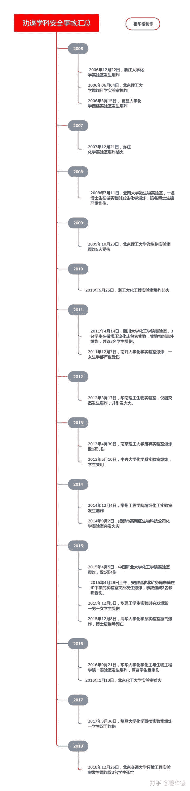
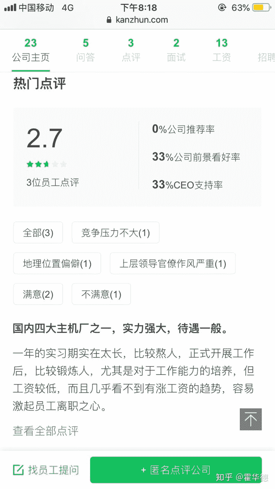
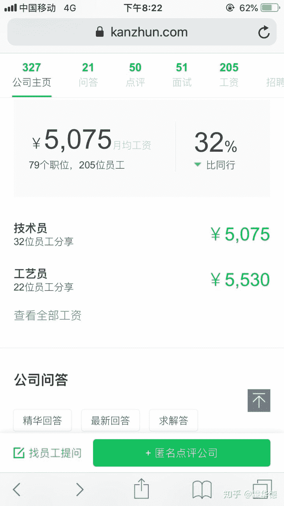
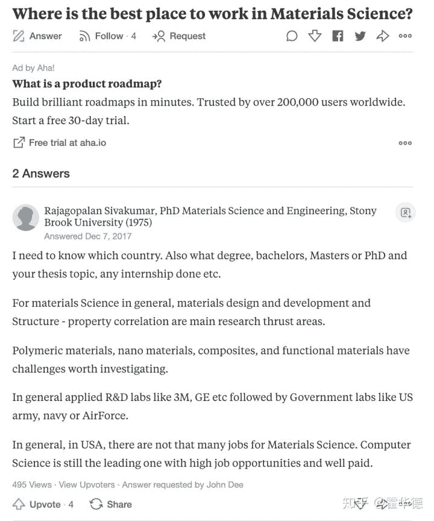
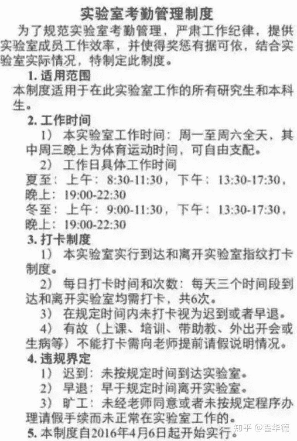
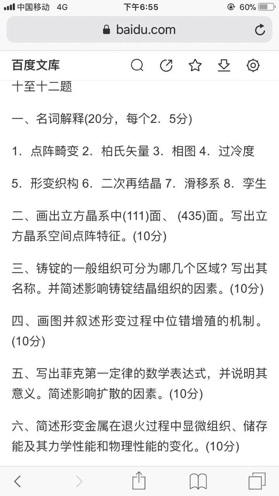
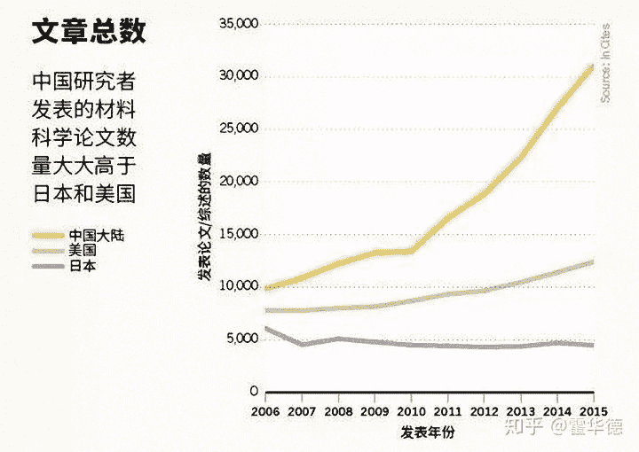
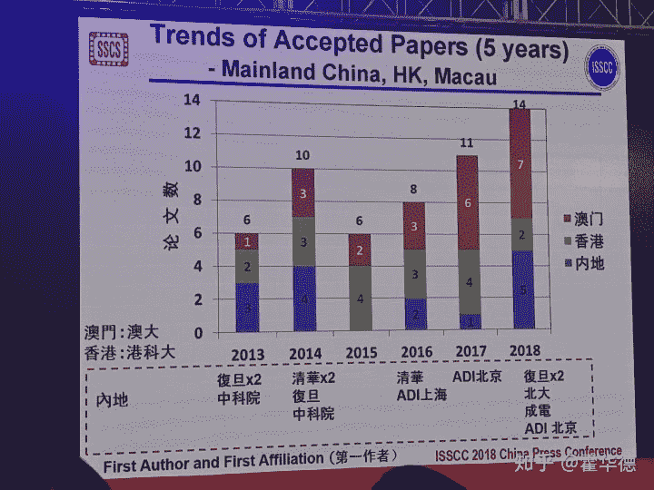

# 我的劝退之总结篇

> 作者：[霍华德](https://zhuanlan.zhihu.com/p/56874296)

**序： 我即是劝退，生化灰飞烟灭，材料在我脚下燃烧。终于，我要在这颗星球上完成我的转行，因为我就是刀锋之王。**

* * *

从2015年开始，我在知乎上陆陆续续写了一些劝退的文章。也遇到一群志同道合的朋友。以后不想再谈劝退的话题了，这些年的所想所思，以及想传递给年轻人的信息就留在这篇文章里。

**劝退的对象：**生化材环，即生物、化学、材料、环境及其相近学科，包括微电子里做纳米材料、纳米器件的也算。这些专业可谓天坑专业。

## **一、我在劝退专业里的故事**

我刚上大学那会就跟下图一样，但谁也逃不脱“**真香定律**”。

从选错专业的那天起，人生就变成一场大逃杀。我本科是学材料的，金属材料加工，简称铸锻焊，其实这个专业就是打铁的，不是调侃，是真打铁。我们专业在全国号称top3，刚进学校觉得自己屌屌的。可是第一次去实习就把我吓哭了。在锻压车间，巨大的气锤从天儿降，冲击在红透的金属上，发出100分贝的噪音，人和人交流基本靠吼，我在里面呆了半小时就觉得自己都快失聪了。在铸造车间，空气中弥漫着三乙胺的恶臭，金属被融化成红色的岩浆，工人穿着肮脏的衣服，就像魔戒里的末日火山，我宛如看到了末日的景象。实习之后，估计是吸入太多粉尘，一回学校就得了肺炎，在校医院躺了一个月，从此下定决心，逃出这个行业。

我博士是学微电子的，转到微电子就是看中超净间里超级干净的环境，可是很快我就后悔了。微电子行业，特别是做微电子制造工艺的，每天要接触大量的剧毒物质，包含且不限于：食人鱼溶液（硫酸+双氧水），王水（硝酸+盐酸），氢氟酸，氰化钾，六甲基乙硅氮烷（HMDS）及各种砷化物。HMDS会导致不孕不育，氢氟酸接触眼睛会导致角膜穿孔，接触肢体会导致组织坏死，轻则截肢，重则致命。我在超净间做实验期间都是如履薄冰，生怕一点疏忽就见不到明天的太阳了。做微电子工艺后，我的皮肤就会经常莫名其妙的溃烂，中医西医都去看过，找不到原因，我怕了，赶紧逃出这个行业。

学材料，最大的好处，莫过于使我痛苦，明白了每个人都有各自的命运。

**那我又是如何走到这一步的呢？**

下面我先谈谈劝退专业差的两个**表象**：

1.  **劝退专业实验环境差，工作环境差，安全隐患大，安全事故多。**
2.  **劝退专业就业形势差，工作难找，待遇低，位置偏远。**

## **二、劝退专业的安全事故与安全隐患**

不到劝退专业你不会懂，什么叫**命运的沉重**，什么叫**人生的绝路。**

由于各高校实验室和设备长期老化，防护措施匮乏，管理不到位，加之没钱改善。全国的生物材料化学化工环境专业每年都要出几个重大大事故，不是爆炸死人，就是炸伤手、炸瞎眼。我汇总了从2006年到2018年劝退专业的安全是事故。

当你发现一只蟑螂的时候，说明你的房子里已经有30只蟑螂了。当你看到一起安全事故，你就应该明白，背后应至少30起安全事故的隐患！更何况，连续十三年，年年都有安全事故，你应该明白这背后的安全隐患有多大！相比，理论学科（数学、统计）、信息学科（计算机、软件）、文科、商科哪里有这么危险。**久在河边走，哪里能不湿鞋。**

就算你念书期间侥幸没有遇上安全事故，但人的身体也不是那么强大的，当你毒气吸多了，你是会生病的！就像我前面提到的，我读博到中后期，身体已经完全崩溃了，就是因为接触了大多有毒的化学物质。很多人并不了解劝退学科要接触多少有害物质。

我特地整理了一份清单：

相信我，只要你在天坑专业，上面提到的这些**危害总有一款你会遇到！**遇到了怎么办？身体是你的，生病了也是你的，身体垮了就完了。没有人会同情你的。导师自然不会管，学校更不会管，谁让你是倒霉蛋呢？就像我们这边矿山里的工人因为矿里粉尘吸入太多，很多人会得矽肺病，矽肺病是绝症，治不好的，没有人会管他们，最后一个个在绝望中死去。

我希望**遇到这样命运的人不是你。**

## **三、劝退专业的就业真相**

**1.传统材料行业**

**高中生常见的一个误区是“以前上高中的时候，因为看过一些关于飞机发动机制造的纪录片，觉得搞材料的人太牛逼了，所以非常向往材料学专业”。**

来，带你看看中国航空发动机四巨头之一的贵州黎阳航空发动机厂的情况：

先看看评价：

再看看待遇：

再来看看中国航空发动机老大沈阳黎明发动机厂的情况：

是的，你发现了，这就是材料行业的就业真相。别看国家把飞机发动机说的多么高大上，材料是核心中的核心。但实际从业人员的待遇就是三五千。各个地区待遇可能略有差异，最多七八千，能够过万的很少。

**2.新型材料行业**

以石墨烯材料为例，目前国内产业化发展情况堪忧。行业主体可以分为两类。

**2.1 偏向学术性单位**

这部分单位依托学术大佬的业内影响力，设立研究院（所），或开设公司。基本无规模产品出产。产出仍然是学术论文。单位的人员基本就是学校内的班子，类似于十几年前的校（院）办企业。这些单位招聘的人一般为徒子徒孙，普通人难以融入。

**2.2 偏向忽悠型单位**

从智联招聘等网站，输入石墨烯相关职位，可以搜出一系列小企业。这些企业研发石墨烯发热材料，纺织材料，发热纤维等。通过收取智商税，赚得企业的第一桶金，然后投资房地产或金融，以求得进一步发展。

## **四、劝退专业是全世界共有的问题**

**那劝退学科是不是中国特有的？**

不！如果你出国，你就会发现，劝退学科几乎没有本国人在学，新加坡、美国、英国等一票发达国家，很少本国人会学生物、材料、化学、环境。最优秀的学生都会去学金融、法律、医学。

**来自美国的劝退:**

有人说，这是印度裔美国人写的，没有说服力。但读者可以去调查一下，在美国的化学系、环境系、材料系是不是中国人、印度人居多，而美国白人学的少。本国人学的少本身就很能说明问题了。

**来自日本的劝退：**

摘抄一段[杨微粒：虚假和绝望的生命科学](https://zhuanlan.zhihu.com/p/20892649)

> 21世紀はバイオの世紀？
> 大学院生の数は1991年から2000年までに倍増したが、教員は増えない。大学院博士課程の大学院生は、まともな教育を受けず、単なる労働力として酷使されている。ある教授は、「大学院生にアタマはいらない」と言い放った。ある教授は、「大学院生はただでつかえる労働力」と断言した。
> 21世纪是生物的世纪？
> 日本研究生的数目从1991年到2000年翻了一番，但是教员数量没有增长。（生物专业的）研究生没有接收到合适的教育，只是作为苦力被压榨。一位教授放言：“研究生不需要自己动脑。”另一位教授则断定：“研究生不过是免费使用的劳动力。”

可见，劝退专业是全世界普遍的问题，而不只是中国特有的问题。不过在美国劝退学科的待遇、认可度好于中国。因为美国化工、材料、生物医药体系更成熟，金融投资更成熟。“忽悠”方向更不容易得到金融或政策扶持。传统的石化、分析、医药行业仍然是美国草根家庭学生寻求人生发展的重要平台。

## **五、劝退背后的深层次原因**

我觉得是合力，这个合力分解之后，共有以下分量：

**1\. 大学扩招**，致使劝退学科毕业生过剩。。对比：80、90年代大学扩招之前，劝退学科人才紧缺，到各个单位都是香馍馍。毕业生过剩的根源在于不是基于市场需求的招生模式，一所高校开设专业，往往并不是基于毕业生的就业情况。而是更多的考验该专业好不好发论文，能不能提高学校的排名和给学校带来更多科研经费，如材料专业在这次双一流中独拔头筹，这并不说明市场需要更多的材料人才。而是因为材料专业好发高影响因子论文。大力发展这个专业有利于学校科研排名的提高。大量学校的伪生化材环专业被评为一流专业，将来必定有一波扩张，扩招大量学生，进一步学历贬值。

**2\. 产业升级失败，**劝退学科所属产业产业升级失败，只能正常中低档产品，利润率较低，致使专业人员待遇较差。生化材环行业滞胀，发展缓慢，同时已经挤压大量从业人员，就业环境和薪酬待遇将进一步恶化。对比：台湾有龙头企业台积电，拿走全球芯片制造50%以上的利润，所以材料专业在台湾是热门专业。

**3\. 投入产出比低**，劝退学科课业压力重，实验压力重，工作环境危险，收益却不高。对比：同样收益一般的文科专业，因为课业轻松环境好，并没有出现大规模劝退现象。文科专业课业相对轻松，你可以拥有一个正常的青春，去吃去喝去爱，你找你最喜欢的男神聊天，去憧憬未来的生活。你参加活动，去丰富生活。而学生物、化学、材料、环境，课业压力大，课程多，实验多，只会压得你喘不过气来。还会有导师打着“科研提高”的名义诱导你去他的“黑砖窑”搬砖，来看看黑砖窑的考勤吧：

**4\. 学科导向问题。**既然产业升级失败，学科发展就应该向着促成产业升级的方向发展。可是劝退学科的发展导向却是向着发论文看齐。南辕北辙。使得劝退学科的产业升级遥遥无期。对于生化材环，整个科研圈已经完全闭环。只要某大佬说石墨烯有前途，大家就会跟风去做石墨烯；过两天说二维材料改变世界，大家就都去跟风做二维材料。而这个游戏可以永远玩下去，根本不用管外界怎么看。

我们来分析下这个闭环是如何形成的：

*   资金源头：国家说科学技术是第一正常力，所以必然每年有一部分财政被划归科研，并且国家重视，科研经费的比例不断提高。
*   经费分配：按照论文数量，论文影响因子，评价科研成果和科研人员的能力，因为可以打着“**科学研究就是目的就不是为了有用，而是为了增长人类的知识**”，完全不用管工业界怎么看，完全不用看实用价值。所以核心指标看论文数量和影响因子。
*   论文和影响因子：学术圈内说是同行审议，但就是小圈子内的相互捧臭脚。你审我的，我审你的，大家都轻松发表。甚至有大佬自建期刊，自己的论文还能不过吗？这样论文数量就上去了。此外，疯狂自引➕疯狂互引，三页的论文恨不得写40-50个参考文献，这样影响因子就上去了。

只要科研圈子从头到尾都默认这个游戏规则：疯狂灌水，疯狂互引-> 高论文数量，高影响因子 -> “高超”的科研水平 -> 更有资格拿到更多的科研经费 -> 更好的实验条件->更疯狂灌水，更高的影响因子-> 无限循环

明白了这个套路，你就明白为啥生化材环的纳米期刊的影响因子都是十几到几十，而传统工科如芯片领域，顶级刊物的影响因子也不过3-4。难道纳米的科研成果就真的就比芯片研究厉害几倍到几十倍？影响力大几倍甚至几十倍？

对于圈内人，这个游戏是可以永远玩下去的，只是苦了硕士博士，发现自己搞的东西，出去根本没人认可。

**5\. 学科内斗问题。**占据额外资源的学科分支，并未产生额外的就业机会。就像类似DOTA游戏，吃资源的大哥，理应给出更多的输出伤害。或者类似于足球场上的前锋，大量机会都给你，理应创造更多进球。化学整体行业亦是如此。经费就那么多，好杂志就这么几个。一个领域占据了额外资源，另一个领域就必须让渡资源。

可惜，目前劝退行业学术圈过热的领域，并未创造出更多的就业机会。在热领域的毕业生，还需要抢占其它传统行业的职位。生化材环传统行业的岗位，如分析检测、医药研发等，职位基本保持稳定。可是热门“新型”专业人才涌入，加剧竞争，使得这些行业待遇增长持平或缓慢于通胀。

这样一来，劝退学科内部就充满了恶性竞争。学科内为争夺有限资源而内斗，却没有开疆拓土的能力，最后结果就是整个行业的萎缩。

## **六、劝退学科深层次的困境**

我最近一直在思考，大家都认为21世纪非常有前途的材料/生物/化学/环境专业为什么这么坑？

**1\. 复杂体系**

材料和生物化学一样 研究对象是复杂体系 一个氢原子的波函数还是可以有解析解，负氢离子以上就要涉及多体问题，引入Hartree-Fock方法，DFT泛函密度等近似了，从原子第一性算起算出一个铁碳相图来？暂时还没办法！

**2\. 经验公式**

没办法从第一性来建模分析问题，那怎么办？材料人就只好依靠经验公式，联系材料强度和晶粒大小的霍尔佩奇关系就是这样的经验公式，材料学里大量这样的经验公式，怎么总结经验公式呢？一个字，试！try and error!

**3\. 穷举的研究方法**

因为从根本原理上无从指导，穷举实验成了大多数材料研究的主要研究方法，列一个参数矩阵就开始grid-search了。原理上和炒菜很像，就是味道淡了加盐，咸了加水，总能测出一些规律来，然后就可以发paper灌水了

**4\. 低效的产出**

因为大家都在瞎试，沿着大概可能的方法试了几十种材料，最后都不一定能用。我有一个夸张的说法，一万种材料里最后能实用产业化的恐怕只有一两种。但研发这一万种材料需要大量的经费，耗材和仪器设备，但最后的产出的呢？不要再用大研小产做幌子，大家都知道投入产出比很低。如果一个行业的产生的实际价值很低，你怎么期待其从业人员有很高的待遇呢？

**5\. 材料的春天**

材料的春天在那里？小百合有春天，材料学可能也有春天。我觉得材料的春天在于计算机科学的大发展，人类有足够的算力从能第一性原理计算预测材料的性质，这样大量的实验可以依靠计算探索，帮助人类锁定少量的候选材料，再去实验。投入很少，但是产出很高，那时候材料的春天就来了~

## **七、劝退学科的教育问题**

此外，劝退学科的教育也有相当大的问题。欧阳颀院士曾直言：“**21世纪是生物的世纪，但千万别进生物系。很多大学的生物系不是在做education，而是在做de-education。用现在的方式培养出来的生物学家来推动21世纪的科技革命，那差得太远**。”

[专访合成生物学家欧阳颀院士：21世纪是生物的世纪，但千万别进生物系-观察-生物探索​www.biodiscover.com](http://link.zhihu.com/?target=http%3A//www.biodiscover.com/news/celebrity/178550.html)

来我们看看，材料专业的专业课考试是什么样子的？

看到材料的考试题就生气。名词解释什么鬼？论述题什么鬼？写出表达式说明意义什么鬼？不用推导，背个公式就开始扯淡。所以伪材料搞科研是不如物理的，因为基础太弱，往往就知道个名词，深层次的推导理解数学结构完全不懂。

材料的课程基本就是工科里的文科，大三大四各种考试全靠背，居然还有什么名词解释题和简述题，但凡深刻一点的原理都不会学，所以学生普遍数理基础差，搞科研只会炒菜，科研被物理系学生全面吊打。

劝退学科教育还有一个问题。劝退学科本科专业大部分时间花在实验报告的书写上。您没有看错，不是做实验、听课和做作业，而是写实验报告。确实，教育的指导思想需要更新。而计算机学科的本科内容，加上实习和实践，足以支撑学生们找到一份待遇尚可的工作。计算机大量学生本科有机会出去实习，而劝退学科很少有听说学生有机会去业界实习。很多人到了大四找工作，才了解到行业的真实情况，悔之晚矣。

## **八、新材料与纳米的真相**

**有人会说，国家不是在大力发展新材料和纳米材料吗？你怎么能说学材料没前途呢？**

我来告诉你真相吧！本科就跟着老师灌过水，材料灌水就跟炒菜一样，师兄做过什么，拿来换个成分，所有表征再做一套，又是一篇paper影响因子还很高。

后来读博来了电子系，看做IC设计的，从设计到流片到测试，忙活几年，真枪实干的做出芯片来，才能发paper，有一些好的工作，过不了几年就能出现在手机产品中，实实在在创造价值 然鹅IC设计最好的杂志solid state circuit才有4.1的影响因子。

看做微电子器件的，摩尔定律之所以能持续几十年，是器件领域不断努力的功劳 把晶体管从几微米一直做到10nm，实实在在推进硬件更高更快更强。然鹅器件领域最好的杂志electron device letter影响因子只有3.0。

对于搞研究，你转什么都行，什么好拿funding转什么，什么好发paper转什么，反正什么热就做什么，肯定没问题。

但也别太当真，你的AM，nano letter工业界并不关心。只发paper的不太会懂，为什么真正产业化的材料就哪几种。10年前的氧化锌，5年前的石墨烯，如今的二维材料，那一个不叫嚣着要取代硅成为电子产业的新霸主。结果呢？还在用硅。

实验室里的器件拿出来，会被甲方吊打成渣。因为是在实际使用环境中，对器件的方方面面的指标都非常严苛。实验室里，在一些极端条件下取得的和在某些方面具有突出性质的材料，能否全面的符合使用条件，这是很难的。这也是为什么大浪淘沙几十年，真正留下的，反复使用的就那几种材料。

我以前写过，为什么锗是第一种被发现的半导体，而如今的 CPU都是硅做的。

[为什么 CPU 只用硅做，而不用能耗更低的锗做？​www.zhihu.com](https://www.zhihu.com/question/28935966/answer/60729143)

其实锗只是band-gap小了一丁点，导致高温稳定性不足，加上没有高质量氧化物的致命一击，最终退出了历史的舞台。

学术界自娱自乐惯了，有些时候应该看看业界的态度，英特尔07年就请了一批做石墨烯的人去开发石墨烯晶体管，结果没出两年，这些人全被赶出来了，你有见现在英特尔台积电大举投资石墨烯的？倒是中国炒作的都快飞起来了。在中国炒作石墨烯的时候，人家比利时欧洲微电子中心IMEC，攻克了三五族材料和CMOS工艺异质集成的问题，随后英特尔台积电三星大举投入，相信在不久的将来，我们就能在7nm，5nm工艺上看到三五族材料的身影。

真正做器件的关心的是路线图，关注ITRS，是制程进展，是器件结构，是漏电，是阈值电压 ，是驱动电压，是能耗，是缺陷，是SPICE，明白自己做的东西要给设计端什么样的参数，明白工艺兼容与良率。

有些事情到最后真是价值观的问题了，你是想放个大卫星，搞个大新闻，还是想实实在在的创造价值，对这个问题的选择，真的会决定一生。

现在越来越多的纳米和材料期刊挂着“芯片”的狗头，卖着纳米和材料的羊肉。**疯狂挤压真正芯片人的生存空间**。我听说不少做正统芯片的老师，受不了高校科研指标的考核，都去搞纳米材料了，真是莫大的损失。

我就告诉你们，中国的纳米和材料早就赶美朝英了。事实上，即使是06年，中国作者发表的材料科学领域论文数量就已经大大超过了美国。而06年-15年间，这一数字又增长了将近两倍。

早在2006年我国研究者发表的材料科学论文就早已高于美国

而实际上，芯片领域真正的情况是什么呢？
**在2018年ISSCC（纯血正统芯片设计顶会）已接受的202篇论文数量中，来自中国内地的数量为5篇，占比约2.5%。而内地+澳门+香港的论文总数是14篇。其中澳门7篇。中国内地浩浩荡荡960万平方公里的土地、13亿人口，在芯片设计领域顶会的论文数量还不及小小的澳门（当然澳门有国家重点实验室）。难道你震惊吗？不该反思吗？**

ISSCC 2018共录用了202篇论文，来自十八个国家的一流大学和研究机构及顶尖集成电路企业，其中录用二篇或以上的企业机构有IBM、三星、Intel、联发科（MediaTek）、台积电（TSMC）、亚德诺半导体( Analog Devices)、博通(Broadcom)、 韩国海力士（SK hynix）、Sony, 德州仪器(TI), 高通(Qualcomm)、东芝（Toshiba）、微软等；大学有美国密西根大学、美国哥伦比亚大学、荷兰代尔夫特大学、韩国科学技术院（KAIST）、澳门大学、美国乔治亚理工学院、韩国浦项大学、加州大学圣地亚哥分校、香港科技大学、美国麻省理工、斯坦福大学、加州大学柏克莱、奥勒冈州州立大学、加州理工学院、卡内基梅隆大学、康奈尔大学、复旦大学等等。

而来自中国内地的参与者屈指可数。醒醒吧，这才是中国芯片的真实情况！！！

知乎上为啥会有劝退党？就是因为我们太清楚这群“挂羊头卖狗肉”的“纳米材料”科研是在搞什么。我国繁荣的纳米和材料研究背后并没有支撑起相应体量的工业应用。在这样的情况下，大学发表的纳米和材料论文和培养的人才越多，就业的形势就越严峻，学生就业的待遇也就越差。

造成这一现象的直接原因是“重科研”“轻应用”的学科发展思路。在多发论文，发好论文的指挥棒下，我国科研人员更热衷于研究新奇的纳米材料，摘取这些“低垂的果实”，而这些成果可能几十年内都难以进行工业应用。而在国际学术期刊主编的口味影响下，中国科研人员热心于研究国外的学术热点。

相反研究传统的国内急需的材料问题、芯片问题，得不到有效投入，步履维艰！！

## **九、劝退专业的忽悠与话术**

1.  **卖情怀**

我依然记得我们老师慷慨激昂地说：

“建造航母需要使用低磁钢、无磁钢，以避免磁性探测和磁性水雷的攻击，但钢铁再怎么做也无法完全绝磁，所以需要大力发展大块非晶合金！为祖国的航母事业添砖加瓦！新一代高强韧性非晶的研发正等待你们的加入，这是祖国和人们翘首以待的高新科技！”

然后我就去非晶课题组搬了一年砖，七年过去了，我查了一下还是没有任何应用。

老师无视航母会定期消磁、大块非晶合金成本高，可加工性差等事实，非常善于用情怀忽悠知识水平还较低的低年级学生。

**2\. 应基二象性**

材料科研的应基二象性：当你问材料老师，你的科研有什么工业应用？他会说我们搞得是基础研究；你问他，那你的研究有什么物理意义？他会说我们搞得是应用研究。

## **十、劝退误区解答**

**Q: 家长都说生物/化学/材料/环境越老越吃香**

**A:**

“生物/化学/材料/环境越老越吃香”是一个历史阶段性的观点，本身就有历史的局限性。

我猜测大多能得出这一结论的人，都基于对过去几十年的观察。过去三十年，是中国极速发展的，那时候中国一无所有，百业待兴，所有行业都有极大的缺口。以高校为例，上世纪八十年代，刚刚恢复高考，高校师资青黄不接，极为缺人，很多人本科毕业就能留校，然后在职读硕士博士，老教授们往往大二三十岁，纷纷退休，职业发展也一片坦途，很多人四十岁就评上教授，伴随着中国经济的高速发展，科研投入加大，这些人自然而然很容易拿到大量经费，戴上帽子。所以你看到的是学化学，毕业留校，评上教授，经费拿到手软，走上人生巅峰，从而得出化学越老越吃香的结论。

那个时代，除了学计算机是“青春饭”，恐怕学什么都越老越吃香，学机械越老越吃香，学土木越老越吃香。

但你要看到现状，中国的存量已经巨大，回复高考四十年，培养的毕业生不计其数，劝退行业疯狂饱和，并且发展缓慢，甚至衰退。你还让人怎么相信“生物/化学/材料/环境越老越吃香”？

**Q：不是说「21 世纪是生物的世纪」？**

**A:**

毕竟离21世纪结束还有80年，谁都说不准以后是不是生物的世纪。

但我想从投资的角度来看这个问题。一个人的职业生涯也就30年，你希望的是这30年的职业生涯里人生价值得到体现。 你如果2010年重仓生物行业，结果2050年生物行业才爆发，有用吗？你重仓计算机朋友，伴随着计算机行业的暴涨，早就赚得钵满盆满，实现了人生价值和自己目标。而你的职业生涯30年，伴随着生物行业的熊市，什么都没赚到，退休了生物行业爆发了，有用吗？你的人生都定型了。

只说一个行业会暴涨，但不谈入场时机，都是耍流氓。

**Q：为什么生化环材专业社会需求这么低的情况下，国家却在大力发展这些学科？**

**A：**

1.  关系国计民生，具有战略地位的生化材。
2.  学术界研究的生化材。
3.  双一流发展的生化材。

1和2交集不大，夹角很大至少超过85度。

国家想发展的是1，其实学校疯狂扩招的是2。

发展1，生化材需求旺盛，就业肯定不差，可以参考日本和台湾。

发展2，没有产业支撑，必然导致需求萎靡，就业不佳。

国家想让3走1的道路，所以批了很多指标；结果3走上了2的道路，只会让就业环境持续恶化。

要破局，必须从2路线改到1的路线上。可现在，还没看到明显的风向转变。

**十年一觉材料梦，赢得劝退薄倖名。我也要move on了。**

**全文完**