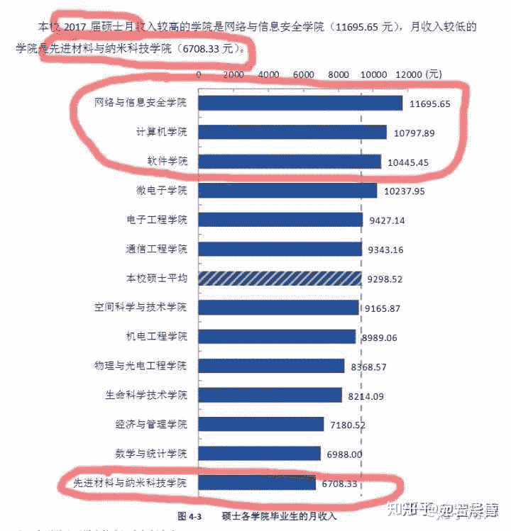
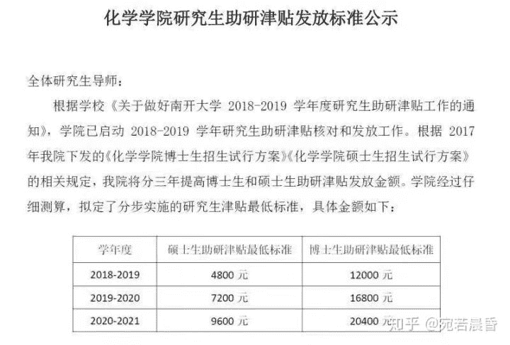

# 为什么要劝退分子科学与工程？

> 原文：[https://blog.csdn.net/wizardforcel/article/details/88090899](https://blog.csdn.net/wizardforcel/article/details/88090899)

> 作者：[宛若晨昏](https://zhuanlan.zhihu.com/p/49924568)

首先屏蔽“分子也是有很多学长学姐非常厉害的！”，“分子XXX发了非常厉害的文章”，“分子的XXX毕业后在哪里工作，财务自由了！”这种“我认识一个大佬”，“我朋友特别厉害”的无聊论据。本文针对分子科学与工程的大多数普通同学（富二代土豪也不属于普通人），即使以后分子出了一个诺贝尔奖得主，和这个专业本身也几乎毫无关系。

本文从**化环材生自身属性**，**分子特色课程设置**，**未来就业**几个角度分析，为什么要对这个专业进行劝退。临时目标是帮助现在在这个专业的同学转走，转不走就尽早对毕业后自己的未来做充分的规划。阶段性目标是改革或是解散该专业。最终目的是劝退绝大多数化环材生专业的普通学生，实现国内教学科研模式的根本性变革。

该劝退文只谈分子专业的劣势。专业优势当然有，也有很多非常负责任的教授导员，和热心的学长学姐。然而，我认为相比于本文谈到的种种**根本性**的劣势，优势都显得无足轻重。欢迎各路人士反驳，但请有理有据，以德服人。

本文是我在这个问题

[分子科学与工程这个专业怎么样？​www.zhihu.com](https://www.zhihu.com/question/24899838/answer/155060270)

的回答基础上的拓展和延伸。

首先让我们来看一下，分子科学与工程是什么样的专业？

天津大学化工学院官网的介绍是：本专业为天津大学化工学院、南开大学化学院联合培养，强强联手优势互补[[1]](http://link.zhihu.com/?target=http%3A//chemeng.tju.edu.cn/cn/jujx%3Ftype%3Dbenkedetail%26typeid%3D4%26id%3D1038)。

它的专业特色是：结合天津大学化工学科的优势和南开大学化学学科的优势，突出创新。该专业既不同于传统的化学、化工类专业，它注重解决化学以及相关的环境、材料和生命科学的问题，同时立足于国家亟待发展的化工新产品研究、开发与产业化的需求，优化化学与化工教学内容，增添新的交叉学科知识，培养适应国家发展需要的，具有良好人文素质和宽广深厚的化学、化工基础，具有较强的创新意识、科研能力和化工新产品研发与产业化能力的复合型人才[[1]](http://link.zhihu.com/?target=http%3A//chemeng.tju.edu.cn/cn/jujx%3Ftype%3Dbenkedetail%26typeid%3D4%26id%3D1038)。

记得刚入学的时候听教授说，分子科学与工程是**培养科研人员**的专业。当时太年轻，根本理解不了“科研”两字之重。不过话说回来，以我国目前的高考和选专业制度，**又有多少人在报志愿的时候深入了解了自己的专业？**而分子，就是在你根本不了解它的时候，死死限制住你在本科的发展方向，致力于让你与这个金融互联网主导的主流社会脱节，进而影响你的保研考研就业选择，从一而终地“献身”科研，真正贯彻“培养科研人员”的方针。

接下来我从三个角度说明劝退该专业的理由。

**一、 化环材生自身属性**

分子专业授予的化学和化工双学位（对大多数人来说应该是世界上最没用的双学位之一吧），本来就自带极强的劝退属性。由于劝退界大佬们已经写了很多相关文章，这里我就只充当搬运工，不再重新造轮子。

[罗多克神射手：拒绝垃圾专业化学：选择正确的专业远比多考几分更重要——致全国高考考生和家长的一封信​zhuanlan.zhihu.com](https://zhuanlan.zhihu.com/p/21424771)

[到处挖坑蒋玉成：劝退学导论：第一部分​zhuanlan.zhihu.com](https://zhuanlan.zhihu.com/p/26647300)

[到处挖坑蒋玉成：《劝退学导论》第二部分（上）​zhuanlan.zhihu.com](https://zhuanlan.zhihu.com/p/27188243)

[到处挖坑蒋玉成：《劝退学导论》第二部分（下）更新​zhuanlan.zhihu.com](https://zhuanlan.zhihu.com/p/28740169)

[弗兰克扬：化学到底是不是一个好专业？该不该转行？————试图以此文终结所有相关讨论​zhuanlan.zhihu.com](https://zhuanlan.zhihu.com/p/24395468)

[弗兰克扬：我们如何走到这一步​zhuanlan.zhihu.com](https://zhuanlan.zhihu.com/p/24751487)

[弗兰克扬：生化环材四大天坑劝退指南​zhuanlan.zhihu.com](https://zhuanlan.zhihu.com/p/30267731)

[是什么让你开始劝退的？​www.zhihu.com](https://www.zhihu.com/question/67812985)

类似文章很多，有兴趣的同学只要到知乎上搜索“化学劝退”、“材料劝退”等关键词，都会看到如果一路走到黑大多数普通人要面临的是什么。我接下来要讲的是，相比于同等学校级别的普通化环材生专业，分子为什么还要**更坑一筹**。

**二、分子特色课程设置**

开门见山。课业压力及转专业。

如果问过去的分子毕业生，你觉得分子给你的印象是什么？相当多的人会说，课业重。

是的，分子因为所谓的双学位，需要比普通学生多修大约50%的学分才可以毕业。举个例子，南开化学专业毕业学分在140-150之间，但是分子专业要在210左右。有同学提到化工专业总分也接近200分，是的，这也是天大化工专业设置（可能是为了保持所谓亚洲第一的位置？）的一大弊端。盲目地增加学分对大多数学生真正的发展毫无意义。

倘若课程有很多是非常有用的数理课程也还罢了，但是让我们仔细检查一下教学计划，在未来对科研真正有帮助的数学、物理、计算机类必修课程有多少呢？

数学：高等数学上，下，线性代数。

物理：大学物理上下，物理化学上下也算半个。

计算机：计算机基础、数据结构与算法（C++）。

That’s it. 总学分大概是三十几分的样子。看到了吗？相比于无穷无尽的过时专业课，最应该好好为科研打基础的数理课程少的可怜。甚至连概率论与数理统计，非常热门且在数据分析中应用广泛的Python都没有。问一问已经开始科研的学长学姐，就算不转码，做研究的时候是不是也要应用大量的统计学、编程、data analysis？你真的觉得当代前沿科研问题是会发明八个机理解释八个酯化反应的图就能解决的？多数都是靠严密的数学、量子物理推导和计算机分析啊！

正因为课程设置如此过时而臃肿，以及落后的选课制度，也就是**基本不允许学生跨学院选课**，导致学生即使想自学其他课程也有心无力。

课程压力过大，使同学们很少有充分的时间去做自己真正想做的事情。我之前也说过，**除了认清化环材生现实之后仍旧一心想留在本专业保研且不出国的同学**，其他任何人都不应该选择分子专业。

为什么？时间。

自由的时间和健康的身体永远是一个人最宝贵的财富。分子专业，连同其他学分设置极多的劝退专业 ，都在浪费你的生命。我接下来要从几个角度重复为什么同学们不应该选择分子专业。

① 对于想出国的同学。

对于硕士，出国申请最关键的是什么？推荐信、三维（即GPA, GRE, TOEFL） 。对于博士，除此之外还有海外科研经历和科研文章。**没有人会因为你比别人多上了70学分的课对你刮目相看，没有。**请不要自己感动自己。反倒因为此专业名气很低（反正我这么多年没见过其他学校的人听说过这个专业的），容易造成不良影响。我们一个个来说。

GPA。即加权成绩。同样一学期，其他专业学3-4门课，分子学6门课，同样的期末复习时间。你认为去哪个专业成绩会更好呢？

GRE, TOEFL。一般来说需要一年左右的备战时间，每门需要考2-3次才能到理想成绩，大多数人是在大三到大四上考。其他专业同学到了大三课表半空，大四没课；分子专业大三满课，大四上还有十几学分。你认为去哪个专业分数会更高呢？

推荐信、海外科研。一般高质量的海外科研需要到名校交流至少五六个月，这样基本可以顺利拿到厉害导师的推荐信。不好意思，分子专业不但不给你一个空学期让你交流，有时连短短两三个月的暑假都会给你几门课。其他专业积攒两三个名校交流和大牛推荐信，蹭了不少文章；分子专业拼命排课拿到一个短期暑研（而且，据说现在协同创新中心已无经费，分子同学出国交换需要**自己出钱**）。你认为去哪个专业申请结果更好呢？

② 对于想考研的同学。

我对这方面不了解所以不多说。但我也清楚，无论是本专业考研还是跨专业考研，都需要非常长的时间来做准备，不少于一年吧。我刚提到过，分子专业即使到了大三下仍旧有大量必修课，这非常影响同学的考研准备。如果是你，你会选择分子去考研吗？

③ 对于想转专业的同学。请参见后面我对于分子转专业的分析。

④ 对于想毕业直接工作的同学。详情请参见第三部分对于分子专业就业的分析。此处插播讲一下实习的问题。

来到美国以后，我发现身边的同学们或多或少都有几段实习经历。这个现在看来再普通不过的事情却让我当时非常震惊。原来，在本科的四年（主要是前三年），我甚至完全没有实习的观念。我觉得它离自己非常遥远，哪怕我当时已经不想读博。因为，分子的专业设置让你几乎没有办法抽出一个学期甚至一个完整的暑假去实习。就算偶尔有人动了这个念头，又去什么地方呢？难道去德州化工厂的电解车间吗？所以，**分子科学与工程专业从来没有形成过企业实习的优良风气**。既然没有学长学姐做过，后来的人更是没有想法，恶性循环，每个一个半月的暑假都是窝在家里虚度光阴或是在闷热的实验室汗如雨下。多少人了解自己努力的方向是什么，又有多少人在准备写简历求职的那一刻才发现它是多么空白？（这里我不想解释**找实习对于未来工作的重要性**，请自行调查） 不只是本科生，国内多数垃圾化环材生课题组都禁止硕士和博士出去实习，这直接导致了这些专业的同学在未来的就业市场竞争力很差。

既然分子科学与工程专业这么坑，那么就赶紧转走保平安吧！

No way! 接下来我要说的是转专业。这是分子专业的一个**核心且致命的问题**。

我们要认清，科研，只是职业的一种，与其他职业一样没有什么特殊之处，它也不是你读了基础科学专业以后的必然就业方向。因为科学家，或是企业高级研发人员，在社会的需求量很少，所以不可避免地绝大多数基础学科专业的本科生在最后都不会从事科研（即使是清华北大也一样）。另外，由于我国高考与报志愿的设计缺陷，相当多的同学在进入高校学习后会发现不喜欢或者不擅长该专业，这是再正常不过的事情。所以，**一个合理的专业，应当有着完善的转专业制度。**这正是分子专业极度匮乏的。

南开班请参考该13级同学的回答[[2]](https://www.zhihu.com/question/24899838/answer/155754012)，希望现在南开班的同学能提供更新的信息。

> 针对分子能不能转专业的真实的故事
> 天大班的分子从入学就被剥夺了转专业的权利，这个每个分子人都知道，而南开班嘛…
> 我大二那年6个同学提出转专业申请，其中包括专业第一名
> 材料都备齐了，到了面试环节
> 除了两个成绩比较尴尬的同学之外，剩下的全部被否了
> 全部被否了。包括专业第一名。
> WBQ老师给出的理由是“转专业理由不充分”
> 看到这里的各位不妨思考一下，什么情况下，学院会不允许成绩好的学生转专业呢？

对于天大班，转专业就更加难了。南开班同学起码在入学时还可以通过伯苓班考试转走，或者在大二结束时放弃化工学位以化学专业单学位毕业。但是天大班同学，由于前两年在南开大学学习，并没有进入求是班的权利，也没有转入天大化工的必要（前两年都把化学学完了）。

尤其恶劣的是，因为你已经带了双学位，你就没有权利根据自身兴趣或发展去**辅修或者双修**，如金融、管理、计算机、经济等对于其他专业同学非常经常去学习的学位。也就是说，这个自带的双学位会严重制约你的未来（尤其是转行）规划。尤其是，18年4月，天津大学已经发布了《关于做好2018年本科生转专业工作的通知》，学院内部也开始大类招生，在这种大环境下，**分子竟然似乎仍然不允许转专业（至少问过的17，18级学弟学妹均不清楚可以转专业，细节待商榷）**。

说到这里，似乎有些人很看不起转行的人，我对此十分不理解。且不说这个本专业到底有多坑，就算是十全十美，就不允许因为兴趣转行了？批评转行，就如同封建社会的三从四德，从一而终，一样迂腐。

所谓转CS多么功利，我倒觉得是你还没有进入到那个领域认真钻研。如果真的深入了解它，你会意识到为什么互联网公司大行其道，为什么程序员工资独树一帜，为什么这才是真正的“二十一世纪学科”。其先进的工业生产模式，生产者开始拥有生产资料的有利条件，以及不可逆转的历史行程，都决定了这一行的出路远远好于普通的化环材生[[3]](https://www.zhihu.com/question/21666262/answer/528430047)。而在普通的实验室里，大多数人只是在浪费纳税人的钱，机械地重复没有任何科学价值的实验，不但数理逻辑日益退化，人际交往水平也每况愈下。这无疑与这个快速发展和变化的社会背道而驰。

我不知道是不是有越来越多的同学意识到这一点，不过，在去年那篇讨论分子科学与工程的帖子[[4]](https://www.zhihu.com/question/24899838)中，我知道已经有**数名当时反对我的同学已经转行了码农**。每年化环材生PhD读不下去quit转码的多如牛毛，不知道为什么**至今没听过有quit CS去转化环材生的**。

**三、分子专业的就业分析**

这部分针对当前应届毕业生的就业市场。十年前的经验已经不再适用。

首先要谈的本科生直接就业。化环材生毕业生（当然包括分子）本科生直接从事本专业的工作，待遇多差工作多辛苦就不必多提了吧（对这一情况没有认识的一二年级同学请自行知乎）。据我所知，我们这届十几个直接工作的同学，只有一名就业与化学化工直接相关，并且他**已转行互联网**。说多少大道理都是空谈，用脚投票才是真理。

剩下的呢？读研就是万事大吉了？不，对多数人这只是一个逃避就业市场的缓冲期，日后如何取决于这段时间的规划发展。那么化环材生的硕士就业就会好吗？数据说话：

西安电子科技大学2017年就业数据

网上没有找到南开天津大学相应的数据，图是前几天西安电子科技大学发布的[[5]](https://www.zhihu.com/question/289151407/answer/529901909)。各个高校之间大同小异。

我在本科的时候注意到，为什么学长学姐谈就业的时候，基本提到的就是宝洁、联合利华等寥寥几个名字？后来我发现，原来，本专业想找直接对口的工作太少，大公司仅有这几个名字能提供工作机会。但是你要知道，国内理工科的硕博中化环材生占据了半壁江山，而那些公司的headcount加起来能有多少呢？估计能赶得上互联网公司的百分之一吧！

而在你成年后仍在读书的二十几岁年华，离了父母你的生活水平又是如何？今天刚刚看到的一份**南开大学化学学院**研究生的补助，读这份单子的时候我笑出了声。

都8102年了，堂堂985高校博士生最低津贴标准才要**涨到12000元**（对你没看错，是年薪）。这是在搞笑吗？

不是，这就是化环材生专业血淋淋的现实。

接着要说的也是重头戏。博士的就业。

归根结底，即使你读了再多年的博士和博后，也是要就业的。但是，真的所有人都清楚如今高校的竞争压力有多大么？有人拿那几个长江，青千学者举例。拜托，那是做了至少十年科研，才千里挑一，千军万马过独木桥的人，失败者是不会吭声的。用@到处挖坑蒋玉成 老师的话说,“2015年化学领域内拿教职的难度就已经高到了荒谬的地步”[[6]](https://www.zhihu.com/question/67812985/answer/256762618)。对，我也知道天大南开青千待遇不错，好像是六十万年薪加一百五十万安家费？但是，如果你在互联网领域能排到同样的位置（前0.1%），不多说，年薪千万不是问题，何况如今互联网大厂厉害的本科应届生工资就有三四十万了吧？至于产业界，呵呵，可能全美国每年招的化环材生博士数量都不如Google一家公司招的码农多吧。如果找不到对口工作，多少人像施一公一样留好了退路？ 随着经济下行，美国中国科研经费大幅度削减，很快博士后都做不成了。你觉得我现实？对不起，**我觉得你幼稚**。

情怀党请不要拿情怀说事（这里我懒得反驳画饼党）。什么是情怀？是在你有能力transfer到更好收入更好环境的前提下，没有那么做，而真心实意地为了国家发展或是个人兴趣投身到某个行业（如军工航天等），并且真的做出了贡献。大多数伪化生的学生符合么？无非是不想去了解外部这个飞速发展的世界，沉迷于自己的一亩三分地不愿踏出那一步。有些人说自己是真的喜欢化学科研，借用一句话，“你喜欢的是化学，还是不学数学物理就能在同学面前无脑装逼的快感？”[[7]](https://zhuanlan.zhihu.com/p/21424771)除了少数有真才实学的课题组，你真的相信自己在实验室做出的东西有任何科学价值么？不要开玩笑了，以目前多数实验室“de-education”的教育模式下，你的努力不但没法回报社会，连养活自己都很困难。精神境界，是在物质需求被满足之后的自然追求，不要本末倒置了。这也是为什么国外读化环材生的小姑娘小伙子大多是富二代（比尔盖茨的女儿在斯坦福读生物）。

**四、总结**

总而言之。分子是一个非常限制人自由发展，回报/付出比很低，本身学习内容又不实用的专业。如果你是天才，那么没关系，分子没能力制约你；如果你是土豪，也没事，家庭可以承担你的一切选择；如果你是普通人，希望我这篇文章对你来说不是废话。

我很清楚会有很多很多人痛恨这篇文章，无所谓，我的观点肯定也有很多错误和不足，欢迎大家批评指正，对事不对人。有人会说我恨这个专业，反过来想想，我倒认为自己对这个专业很有感情，才会愿意花大量的时间指导这个专业的学弟学妹们，帮助他们在未来获得更好的回报，拥有更美好的人生。而反对者们如果真的像他们口口声声所说那么热爱这个专业的话，也不妨把观点坦诚相见，我们取其精华，共同助力分子的转专业制度改革，造福后人。

**参考资料**

[1] 天津大学化工学院官网

[http://chemeng.tju.edu.cn/cn/jujx?type=benkedetail&typeid=4&id=1038](http://link.zhihu.com/?target=http%3A//chemeng.tju.edu.cn/cn/jujx%3Ftype%3Dbenkedetail%26typeid%3D4%26id%3D1038)

[2] 分子科学与工程这个专业怎么样？——匿名用户的回答

[https://www.zhihu.com/question/24899838/answer/155754012](https://www.zhihu.com/question/24899838/answer/155754012)

[3] 为什么很多大学生甚至研究生抛弃专业去做码农呢？——David Zhang的回答

[https://www.zhihu.com/question/21666262/answer/528430047](https://www.zhihu.com/question/21666262/answer/528430047)

[4] 分子科学与工程这个专业怎么样？[https://www.zhihu.com/question/24899838](https://www.zhihu.com/question/24899838)

[5] 如何看待薪酬网2018最新毕业生薪酬数据中材料物理、生物科学专业跻身前五？

——霍华德的回答 [https://www.zhihu.com/question/289151407/answer/529901909](https://www.zhihu.com/question/289151407/answer/529901909)

[6] 是什么让你开始劝退的？ ——到处挖坑蒋玉成的回答

[https://www.zhihu.com/question/67812985/answer/256762618](https://www.zhihu.com/question/67812985/answer/256762618)

[7] “拒绝垃圾专业化学：选择正确的专业远比多考几分更重要 ——致全国高考考生和家长的一封信” [https://zhuanlan.zhihu.com/p/21424771](https://zhuanlan.zhihu.com/p/21424771)