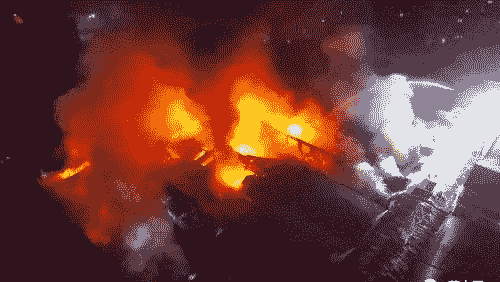
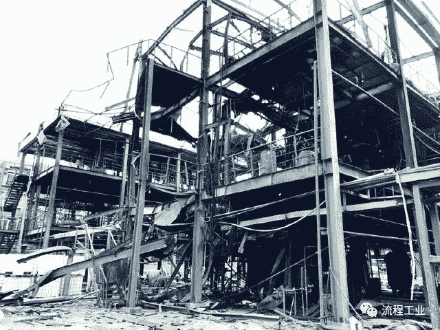
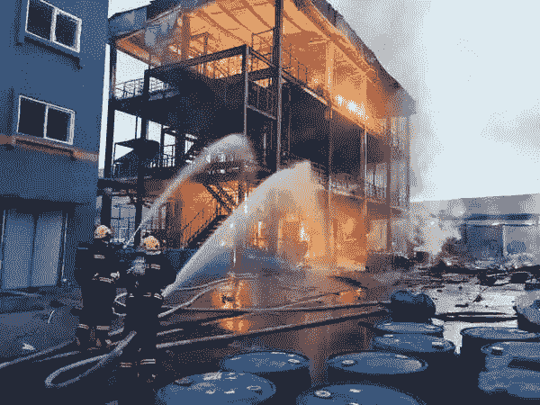
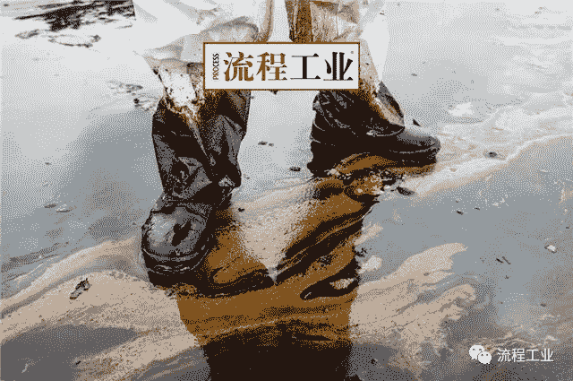
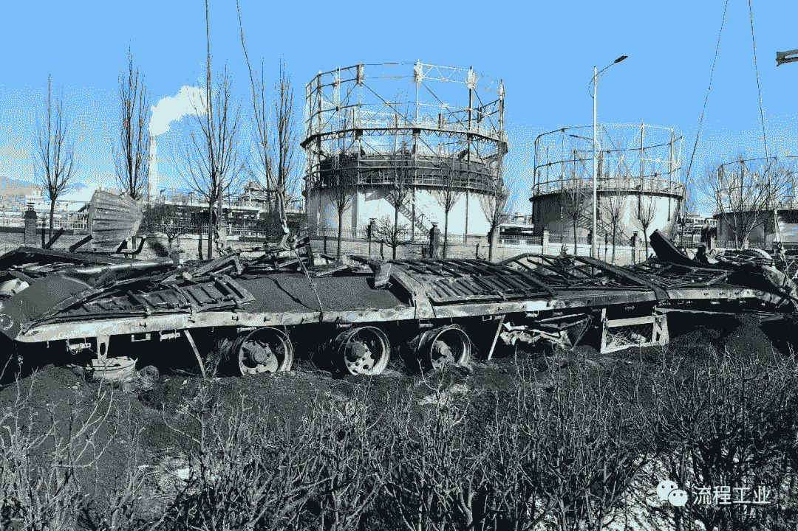

# 盘点2018年化工行业大事故！回顾那些令人心痛的瞬间......

> 作者：[流程工业](http://www.sohu.com/a/289864353_479771)

2018年事故不断发生，损失不可不谓之惨重。从山东枣庄市**爆炸事故造成9人死亡**到四川宜宾化工厂**燃烧造成19人伤亡**，这些数字透漏出来严重的安全问题，**企业到底该如何搞好化工安全？安全人该如何履行好职责？**接下来，跟随流程程一起回顾2018年13起较大化工事故心痛瞬间！

## 1.新疆吐鲁番恒泽煤化公司“1•24”闪爆

2018年1月24日，新疆吐鲁番市恒泽煤化有限公司在对改质沥青高位槽油气回收管道进行检维修作业时发生闪爆，造成3人死亡、1人重伤，事故教训深刻，影响严重。事故具体起因尚未公布。

## 2.山东临沂金山化工公司“2•3”爆燃

2018年2月3日上午10时51分，位于山东省临沂市临沭县经济开发区的金山化工有限公司，在停产整顿期间非法组织生产，发生爆燃事故，造成5人死亡（含邻氯氯苄生产作业人员2名）、5人受伤（其中1人重伤）。

该起事故是继临沂金誉石化公司“6•5”重大爆炸事故、山东日科化学股份有限公司“12•19”爆燃事故之后山东省发生的又一起性质严重、影响重大、教训深刻的典型事故。

2月3日，事故发生前两套装置都处于生产状态，并且正在进行环保设施（废气有组织排放改造工程）的安装作业。上午10时51分，因改造过程中使用塑料焊枪，引燃尾气管线中四甲基硅烷、氯甲基三甲基硅烷等可燃性气体，回火引爆分离釜内物料，发生爆炸事故并引发着火。

## 3.河北唐山华熠公司“3•1”爆燃

2018年3月1日12点20分，天良公司施工人员在本公司苯加氢车间实施污水储罐罐顶施工作业后，清理施工工具时，产生火花致使污水储罐起火，导致包括天良公司施工人员及唐山华熠人员在内的5名人员4人死亡、1人受伤（其中唐山华熠员工1人死亡、1人受伤）。

## 4\. 江西九江“3•12”爆炸

2018年3月12 日 16时15分，江西省九江石化60万t/a柴油加氢装置分液罐容501爆炸起火，30分钟后，火势得到控制。目前事故已造成2人死亡，1人轻度灼伤。事故原因初步分析为60万t/a柴油加氢装置循环氢压缩机C502B润滑油压力低联锁停机，引起装置波动高压窜低压，引起原料罐501撕裂泄漏着火。

## 5.枣庄市薛城区“3•27”较大爆炸事故

危险化学物罐体操作造成9死3伤！山东枣庄爆炸事故调查报告发布

2018年3月27日，在枣庄甘霖实业有限公司对外出租的废旧仓库内，河北省邯郸市广平县人张恒、李继兴、武廷生借用枣庄泓劲商贸有限公司营业执照进行非法建设时，发生了爆炸事故，造成9人死亡、3人受伤，直接经济损失约900万元。

27日下午，张恒、李继兴、武廷生、刘振晓、刘志平组织工人，在租赁的甘霖实业公司原设备仓库内，进行非法建设。16时52分，现场施工人员在对一碳钢罐阀门进行动火作业过程中，碳钢罐突然发生爆炸。

甘霖实业公司原设备仓库，为一长方体建筑物，实际面积为1 028 m2。经现场勘查，爆炸中心距离仓库东墙约25m ，仓库顶棚和墙体不同程度损坏，正上方钢结构横梁飞散，周围钢结构梁受爆炸超压影响严重弯曲，南侧砖混结构墙体坍塌，东侧砖混结构墙体呈现较大裂隙。碳钢罐在爆炸中解体，罐体圆形底盘残留在爆炸中心，爆炸中向下冲击造成地面凹陷，罐体残骸等飞溅物最远抛至100 m,周边120 m左右的建筑物玻璃也受到爆炸冲击波影响,造成不同程度损坏。经计算，此次爆炸事故TNT当量约为109~193 kg。

导致事故发生的直接原因包括现场施工队伍不具备资质处置废旧罐体，施工作业前未采取清洗、置换和检测等安全措施，违规动火作业产生的高温或火花引爆罐体内残留的2,6-二硝基苯酚，加之罐体相对密闭，导致爆炸破坏力加强。

## 6.天津渤化永利化工公司“4•26”中毒窒息

2018年4月26日20时40分，中石化工建设有限公司5名工人在天津渤化永利化工股份有限公司维修作业时，发生氮气中毒事故，其中3人死亡，2人受伤。

## 7.上海赛科公司“5•12”闪爆

赛科石化突发事故，6人死亡，如何保障储罐动火作业安全？

2018年5月12日下午15时25分左右，在上海赛科石油化工有限责任公司公用工程罐区位置，上海埃金科工程建设服务有限公司的作业人员在对苯罐进行检修作业过程中，因苯罐发生闪爆，罐顶撕裂，罐体位移，造成在该苯罐内进行浮盘拆除作业的6名作业人员当场死亡。经调查认定，此次事故是一起生产安全责任事故。

此次事故发生的直接原因为75-TK-0201内浮顶储罐的浮盘铝合金浮箱组件有内漏积液（苯），在拆除浮箱过程中，浮箱内的苯外泄在储罐底板上且未被及时清理。由于苯易挥发且储罐内封闭环境无有效通风，易燃的苯蒸气与空气混合形成爆炸环境，局部浓度达到爆炸极限。罐内作业人员拆除浮箱过程中，使用的非防爆工具及作业过程可能产生的点火能量，遇混合气体发生爆燃，燃烧产生的高温又将其他铝合金浮箱熔融，使浮箱内积存的苯外泄造成短时间持续燃烧。

虽未造成次生灾害和环境污染，但造成直接经济损失约1166万元，其中设备损失约536万元。

## 8.四川宜宾“7•12”重大爆燃事故

相关阅读：突发｜四川宜宾一化工厂爆燃致19人死亡，警钟长鸣！

2018年7月12日18时30分，四川省宜宾市江安县的宜宾恒达科技有限公司发生重大爆炸着火事故，造成19人死亡，12人受伤。据调查，这是自2012年以来我国化工企业死亡人数最多的一次事故，也是企业违法违规问题最多、最严重的一次事故，事故损失惨重，社会影响十分恶劣。

国家企业信用信息公示系统显示，宜宾恒达科技有限公司成立于2015年，是一家从事化学原料中间体和化学制品研发、生产的精细化工企业。事故现场了解到，该企业生产过程涉及多种重点监管危化品和重点监管工艺，但是未按相关要求安装自动化控制系统、报警系统及消防水系统。此次发生爆燃的正是刚刚投产两个月的中间体生产新装置，反应釜上甚至没有预留安装相应设施的接口。由于缺少了自动化系统，每班需有10余人在反应釜周边操作，这正是此次事故造成众多人员伤亡的重要原因之一。

## 9.福建泉州碳九泄漏事件

69.1吨变6.97吨！恶意串通、伪造证据！泉州东港石化碳九泄漏事故官方正式通报！相关人员被免职

2018年11月4日凌晨，福建东港石油化工实业有限公司执行碳九(石油炼制副产品中含有9个碳原子芳烃的聚合物)装船的宁波“天桐1号”船舶与码头连接软管处发生泄漏，共造成69.1 t碳九泄漏。涉事企业安全生产隐患严重，泄漏事件发生时存在违规作业。发生泄漏事件后，企业隐瞒泄漏数量，谎报泄漏量为6.97 t，实际造成69.1 t化学品泄漏。目前7名直接责任人员已被批捕。

## 10.河北金万泰化爆炸事故

2018年11月7日下午15时10分，河北金万泰化肥有限责任公司造气车间尾气燃烧炉发生爆炸。事故发生后，政府有关部门及企业迅速开展营救，受伤人员立即送往医院抢救。目前，事故已造成6人死亡、2人重伤、5人轻伤。事故原因正在调查中。

## 11.张家口“11•28”重大爆燃事故

2018年11月28日零时41分，河北省张家口市桥东区河北盛华化工有限公司发生爆炸起火事故。经初步调查，事故中过火大货车38辆、小型车12辆。事故直接原因是中国化工集团河北盛华化工有限公司氯乙烯气柜发生泄漏，泄漏的氯乙烯扩散到厂区外公路上，遇明火发生爆燃，导致停放公路两侧等候卸货车辆的司机等23人死亡、22人受伤。23位遇难者当中除了3人为附近公司员工，2人为附近村民，剩下的大多都是货车司机。

这是近年来央企发生在化工生产企业伤亡最严重的事故，也是自 2012年 河北克尔化工有限公司“2•28”重大爆炸事故造成 29人死亡后，全国死亡人数最多的化工事故，再次暴露出化工和危险化学品安全生产的复杂性和严峻性。

据调查发现，氯乙烯气柜开工六年从未检修，气柜泄漏后操作人员操作错误，企业未采取任何措施防止氯乙烯扩散到省道，企业生产管理十分混乱，一把手多年未在工厂露面。

事实上，这样的安全事故在盛华化工并非首次发生：2013年和2014年，该企业曾发生2起安全责任事故，共导致2人死亡。

在2015年张家口安监局的执法检查通报中，该企业存在氯乙烯气柜进口排水阀泄漏严重等71项隐患。

## 12.山东济南汇丰燃爆事故

2018年12日9时，平阴县孔村镇济南汇丰炭素有限公司在组织沥青储存池导热炉维修过程中，发生燃爆事故，造成6名员工当场死亡，5名员工受伤。其中2人重伤，3人轻伤。事故发生后，济南市及平阴县立即启动事故应急预案，5名伤者被及时送往医院进行抢救。经初步勘察和了解，该企业沥青储存池（密闭）气相空间形成的爆炸性混合气体，遇维修过程中产生的明火后发生燃爆。目前事故原因正在调查中。

## 13.江苏如皋众昌氟化氢中毒事故

12月18日10时35分许，如皋市众昌化工有限公司发生一起氟化氢中毒事故，造成3人死亡。经初步调查，该事故是由于液氮深冷导致化工装置材质冷脆，加之超压造成设备爆裂，设备内的氮气以及氟化氢泄漏，氟化氢造成现场作业人员3人中毒死亡。

## 成于安全，败于事故

从这几起事故来看，检维修、受限空间、动火等特殊作业是事故高发环节。

针对化工安全各项问题，12月25日国务院安委办、应急部发布了《关于做好岁末年初安全防范工作的通知》，要求企业落实安全生产责任到每个环节、每个岗位和每名员工，深入细致开展隐患排查治理，严防各类事故发生，确保安全生产形势稳定。通知中对化工领域做出下列要求：

要加强危险化学品生产装置、罐区、气柜等重点部位安全管控，节日期间动火等特殊作业实行升级管理，确保防冻、防凝、防滑、防静电等冬季防护措施执行到位。

要强化途经人员密集场所等高后果区的油气输送管道隐患排查，落实管道企业日常巡护措施，严格审批监督管道周边施工作业，严防乱挖乱钻引发管道泄漏着火爆炸等事故。

要高度重视烟花爆竹旺季生产、经营、运输、储存、燃放等各环节安全监管，结合公安机关正在开展的打击整治枪爆违法犯罪专项行动，严厉打击非法生产储存经营烟花爆竹行为。

**岁末年初，希望生产者和管理者在警示中安全前行！**