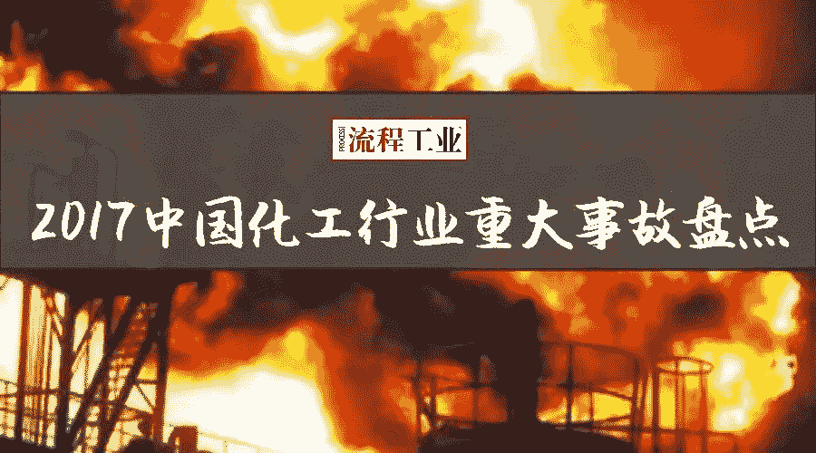
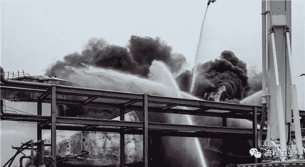
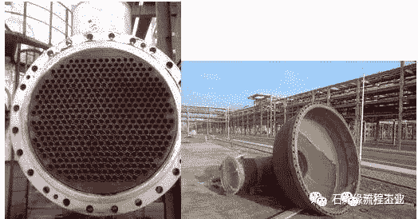
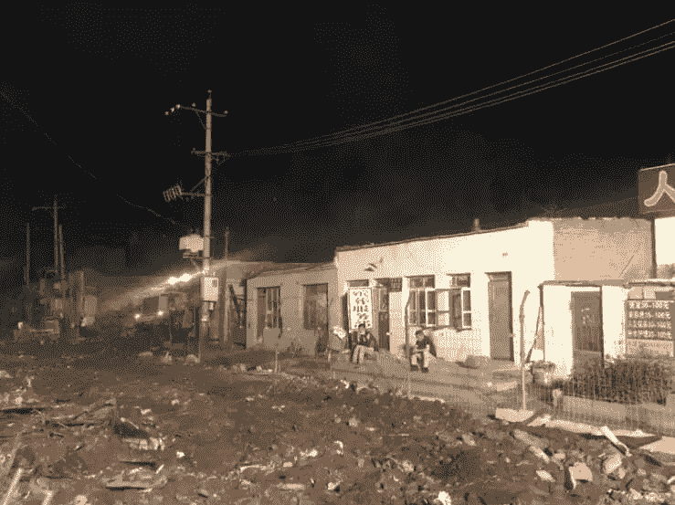
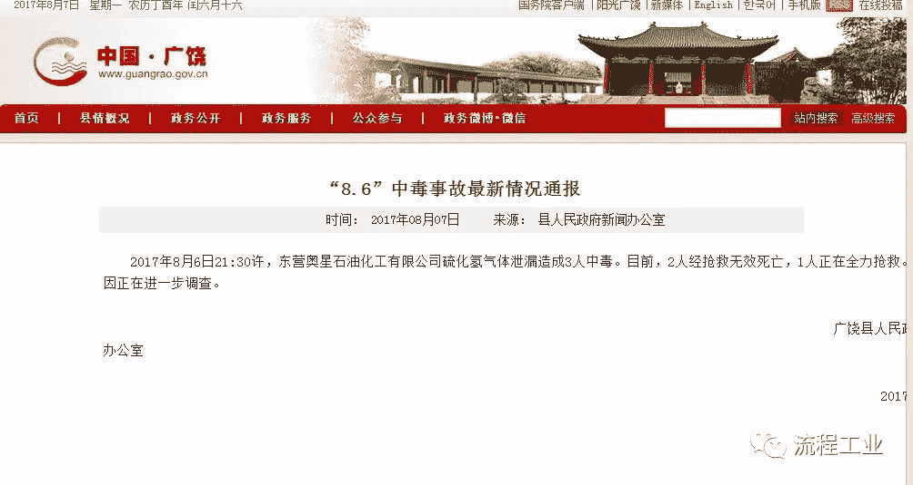
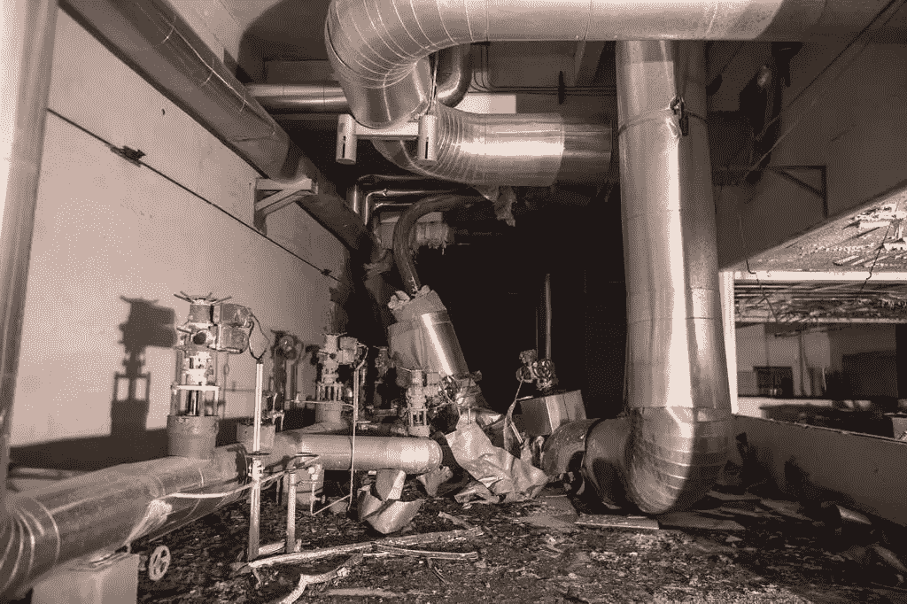

# 触目惊心！2017年化工行业事故203起死亡238人！附重大事件回顾

> 原文：[https://blog.csdn.net/wizardforcel/article/details/87856461](https://blog.csdn.net/wizardforcel/article/details/87856461)

> 作者：[流程工业](https://www.sohu.com/a/211831846_479771)

国家安全监管总局近日披露，今年前11个月，化工行业共发生事故203起、死亡238人，事故总量依然很大，重大事故仍未得到有效遏制。12月9日，连云港聚鑫生物科技有限公司发生10人死亡、1人受伤的重大爆炸事故，是今年以来国内发生的第2起化工重大事故。流程君今天整理了化工行业今年至今为止的重大事故，愿大家在警示中安全前行。

国家安全监管总局近日披露，目前全国有近30万家危化品生产经营单位，其中安全保障能力比较差的小化工占80%以上。

会议指出，今年以来全国发生的化工事故暴露出当前安全生产工作存在着一些深层次突出问题：

*   一些地方和企业安全发展理念没有牢固树立；

*   部分地方政府监管责任落实不到位，重点工作不落实，推动企业安全生产主体责任落实不力；没有认真吸取历史上同类事故教训；

*   设计、建设、安全评价等第三方机构履责不到位，埋下安全隐患。

**关于今年化工行业内发生的重大事故，“流程工业”进行过详细的报道，今天请跟随流程君一起回顾。**

## 金誉石化爆炸

2017年6月5日凌晨1时左右，临沂市金誉石化有限公司储运部装卸区的一辆液化石油气运输罐车在卸车作业过程中发生液化气泄漏，引起重大爆炸着火事故，**造成10人死亡，9人受伤**，直接经济损失4468万元。

经计算，本次事故释放的爆炸总能量为31.29吨TNT当量，产生的破坏当量为8.4吨TNT当量（最大一次爆炸）。

事故原因

**直接原因：**

肇事罐车驾驶员长途奔波、连续作业，在午夜进行液化气卸车作业时，没有严格执行卸车规程，出现严重操作失误，致使快接接口与罐车液相卸料管未能可靠连接，在开启罐车液相球阀瞬间发生脱离，造成罐体内液化气大量泄漏。

**间接原因：**

临沂金誉物流有限公司、临沂金誉石化有限公司、河南省清丰县安兴货物运输有限公司等相关组织单位未落实安全生产主体责任。

**详情请点击标题阅读：**

## 乌石化检修事故

2017年11月30日12时20分左右，中石油乌鲁木齐石化公司炼油厂在换热器检修作业中发生事故，**造成5人死亡，16人受伤（其中3人重伤）。**

初步起因剖析

E2208/2检修前壳程蒸汽压力未泄放，从DCS历史趋势考察，检验时壳体压力2.2MPa，换热器管箱螺栓拆除残余至5根时，螺栓生效断裂，管箱及管教在蒸汽压力作用下，从壳体飞出，造成施工及周边职员伤亡。

该起事故是新疆维吾尔自治区区今年继新疆宜化化工有限公司“7·26”燃爆事故之后发生的第二起较大化工事故，也是中石油企业连续第三次发生事故。国务院安委会将对该起事故查处挂牌督办，事故原因还在调查中。

**详情请点击标题阅读：**5死16伤 | 乌石化“11·30”事故原因剖析！

## 贵州天然气输气管道燃爆

（现场视频，建议WIFI环境下观看）

[https://imgcache.qq.com/tencentvideo_v1/player/TPout.swf?max_age=86400&v=20140714](https://imgcache.qq.com/tencentvideo_v1/player/TPout.swf?max_age=86400&v=20140714)

2017年7月2日10时许，中石油天然气输气管道贵州晴隆沙子段，因近期持续强降雨引发边坡下陷侧滑，挤断输气管道，引发泄漏燃爆。**初步查明造成８人死亡，35人受伤。**

事故原因仍在调查，尚未公布。

**详情请点击标题阅读：**8死35伤! 贵州天然气输气管道突发泄漏燃爆事故！

## 吉林松原燃气管道爆炸

7月4日14时45分许，松原市宁江区繁华路巷路施工过程中造成燃气泄漏，燃气公司在抢修时发生爆炸。截至目前，经核实，**事故共造成5人遇难，89人（其中14人重伤）**住院治疗。

事故原因仍在调查，尚未公布。

**详情请点击标题阅读：**突发 | 吉林松原燃气管道泄漏爆炸，已致5人遇难89人受伤！

## 山东东营硫化氢泄漏

2017年8月6日21:30许，东营奥星石油化工有限公司硫化氢气体泄漏造成3人中毒，**2人经抢救无效死亡。**事故原因正在进一步调查。

**详情请点击标题阅读：**2人死亡 | 山东东营奥星石化硫化氢气体泄漏！（附硫化氢浓度与危害对比表）

## 华强化工喷嘴裂爆

2016年8月11日14时49分，湖北省当阳市马店矸石发电有限责任公司热电联产项目在试生产过程中，2号锅炉高压主蒸汽管道上的“一体焊接式长径喷嘴”（企业命名的产品名称，是一种差压式流量计，以下简称事故喷嘴）裂爆，导致发生一起重大高压蒸汽管道裂爆事故。

事故共造成26人伤亡，其中，21人当场死亡，1人经抢救无效后死亡，死亡原因为高温合并冲击波损伤；4人重伤在医院接受治疗。事故共造成直接经济损失2313万元。

事故原因

**直接原因：**

安装在2号锅炉高压主蒸汽管道上的**事故喷嘴是质量严重不合格的劣质产品**，其焊缝缺陷在高温高压作用下扩展，局部裂开出现蒸汽泄漏，形成事故隐患。

**相关人员未及时采取停炉措施消除隐患，焊缝裂开面积扩大**，剩余焊缝无法承受工作压力造成管道断裂爆开，大量高温高压蒸汽骤然冲向仅用普通玻璃进行隔断的集中控制室以及其他区域，造成重大人员伤亡。

间接原因：

*   采购、供应的事故喷嘴是质量严重不合格的劣质产品，产品质量是肇事的最主要原因。

*   发现事故喷嘴泄露形成重大事故隐患时，企业没有及时有效处置，是造成事故的最直接原因。

*   厂房设计不符合标准规范要求，人员聚集的集中控制室失去安全防护作用。

*   管道检验检测没有按标准规范进行，监管缺失，放过了焊缝隐患。

此外，相关的单位及人员已受到追责和行政处罚。

**详情请点击标题阅读：**可怕的人祸 | 死22人，追刑责15人，处分30人，华强化工马店矸石发电公司事故调查报告发布

## 大连硫化氢中毒

2017年11月18日19点15分左右，河南鄢陵京顺石化机械设备有限公司9名工人在大连西太平洋石化公司硫磺装置做设备检修和换热器管束清洗作业时，发生硫化氢中毒，伤员立即被送至医院，**其中3人伤势较重死亡****，另外6人经大连医科大学附属第一医院留院观察**，生命体征平稳。

目前大连市政府已由安监局牵头成立事故调查组，事故原因正在查明中。

详情请点击标题阅读：突发 | 大连西太平洋石化发生硫化氢中毒事故，9人伤亡！

## 陕西西岳制药反应釜爆炸

（现场视频，建议WIFI环境下观看）

[https://imgcache.qq.com/tencentvideo_v1/player/TPout.swf?max_age=86400&v=20140714](https://imgcache.qq.com/tencentvideo_v1/player/TPout.swf?max_age=86400&v=20140714)

11月25日早上6点多，华阴西岳制药有限公司一车间甲醇反应釜发生爆炸，**造成7人受伤，事其中1人死亡，1人重伤，2人轻伤，3人轻微擦伤。**

事故发生后，华阴市委、市政府主要领导、分管领导第一时间赶赴现场指挥救援处置工作。伤员救治、事故调查、善后处置等各项工作正有序进行。

**详情请点击标题阅读：**

## 连云港二氯苯装置爆炸事故

（现场视频，建议WIFI环境下观看）

[https://imgcache.qq.com/tencentvideo_v1/player/TPout.swf?max_age=86400&v=20140714](https://imgcache.qq.com/tencentvideo_v1/player/TPout.swf?max_age=86400&v=20140714)

2017年12月9日凌晨2时20分左右，连云港聚鑫生物科技有限公司（以下简称聚鑫公司）年产3000吨间二氯苯装置发生爆炸事故，**造成4人死亡，1人受伤，6人被困**，间二氯苯装置与其东侧相邻的3-苯甲酸装置整体坍塌，部分厂房坍塌、建筑物受损严重。

事故原因

根据现场勘查，事故原因初步分析：保温釜压料过程中，严重超压**（设计压料系统应使用氮气，正常操作压力为1.5公斤，实际操作改用了5.8公斤的压缩空气进行压料）**造成保温釜内物料从视镜处泄漏、冲料，摩擦产生的静电引燃物料，并引发装置外侧下方的成品精馏釜等爆炸。

**–END–**