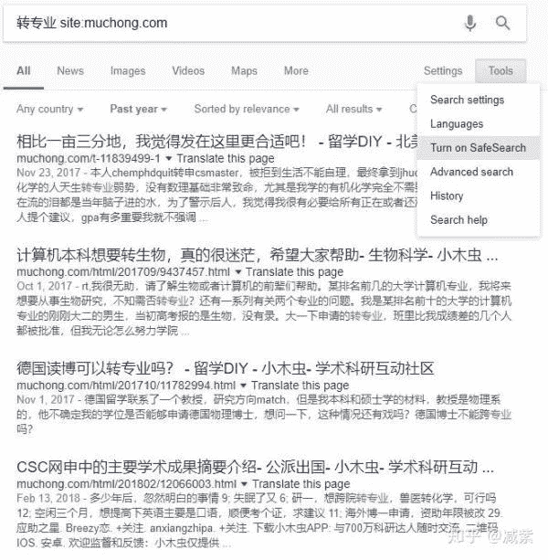
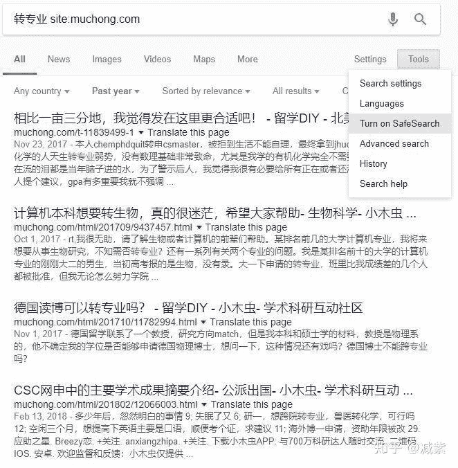
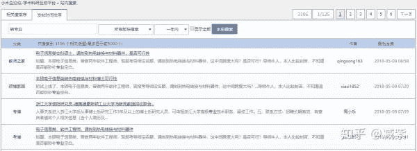
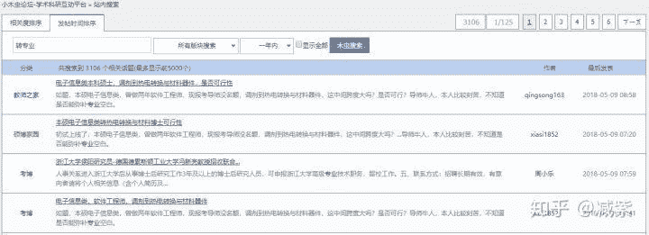
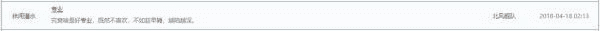
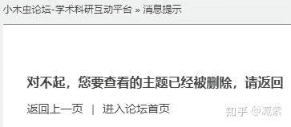
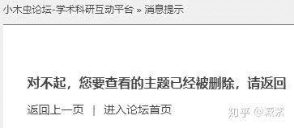
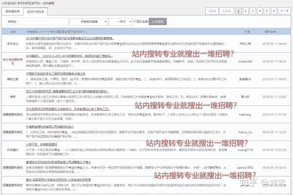
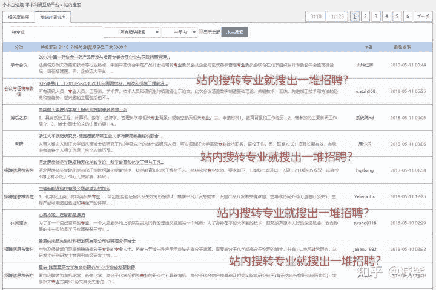

# 小木虫刻意隐瞒伪化生学科现状，劝人入坑，天打雷劈！

> 作者：[减紫](https://www.zhihu.com/question/268870893/answer/387418302)

首先翻一下平台背景各位就明白了：

小木虫是创始人李国德在2001年12月个人独立创办的，原名"清风小木虫专业代理论坛"，后更名为小木虫论坛，小木虫后被学而思教育公司收购。

张邦鑫，学而思教育**创始人及CEO。2001年本科毕业于四川大学生命科学学院**，2002年进入北京大学学习研究生课程，2003年就读研究生期间与同学合伙创办奥数网，两年后正式将机构取名为学而思，专门从事中小学课外辅导培训。2010年10月，学而思上市。——感谢

[@天眼查](//www.zhihu.com/people/fc1e8ef4a24b7220a62f53e26c0a951e)

提供的数据。

这大概就是为什么转专业劝退的帖子就算搜索引擎能挖出一把来，小木虫自带的搜索都搜不出吧。

* * *

咱们直接搜过去1年小木虫转专业有什么热门贴：

这里选关掉安全搜索，如果截图点下去则会打开

其实仔细一看问题没那么大：

第一个帖子是化学博士转cs硕士吧，警示大家GPA千万不能低——这话太对了

> 本人chem phd quit转申cs master，被拒到生活不能自理，最终拿到jhu cse的录取，我们学化学的人天生转专业弱势，没有数理基础非常致命，尤其是我学的有机化学完全不需要学数学，所以说现在流的泪都是当年脑子进的水，为了警示后人，我觉得我很有必要给所有正在或者还没有意识到转专业的人提个建议，gpa有多重要我就不强调了，希望大家在化学的世界徜徉的时候别忘了数学才是基础，真正申请的时候才发现转cs也分EE转cs，其他engineering转cs，最后才是化学生物转cs

第二个帖子是……计算机转生物的（我不吐槽）；

第三个是材料转物理的；

第四个问医学分支转化学（我就是不吐槽）；

第五个问数学转统计的；

第六个问物理系转专业的；

**按知乎的政治正确看，最多是好的转差的有，差的转好的帖子也有，五五开，但奇怪的是除了少部分帖子点进去都是小木虫镜像，而镜像，是无法链接到原帖子的：**

是跳转到[热门话题贴 - 排行榜 - 小木虫论坛-学术科研互动平台](https://link.zhihu.com/?target=http%3A//muchong.com/bbs/top.php%3Ff%3Darticle) ，（顺带一提这两日热帖是[做合成毒性那么大，你为什么还在坚持？ - 新药研发 - 其它 - 小木虫论坛-学术科研互动平台](https://link.zhihu.com/?target=http%3A//muchong.com/t-12313342-1) 233）而不是原帖，**很可能原帖已经和**

[@为啥要填真实姓名](//www.zhihu.com/people/0f33effb9145e88d907244ceef0fa0fe)

的帖子一样消失了。于是所幸跳回站内搜索，干脆把1-9页的都过了一遍

这1个问题用不着刷3遍吧……而且2个ID1个是2010年注册的真的没问题？！那另一个在炒坟贴？

后面剔除掉招聘帖（鬼知道怎么搜出那么多招聘帖的）剩下的贴是：

[小木虫论坛-学术科研互动平台](https://link.zhihu.com/?target=http%3A//muchong.com/t-12317974-1) 本科和硕士都是水利类211院校专业背景出身，地级市国土局事业单位VS不知名三线城市小私企证券公司跑业务——这其实是问转方向就业吧

[小木虫论坛-学术科研互动平台](https://link.zhihu.com/?target=http%3A//muchong.com/t-12317433-1) 学地质专业**出来就业**是不是要干本行——这其实是问转方向就业吧

[小木虫论坛-学术科研互动平台](https://link.zhihu.com/?target=http%3A//muchong.com/t-12316747-1) 学内燃机**问毕业后**去企业干新能源还是考公务员高校辅导员——这帖子众人最后推荐（小转）电控——推荐对了——然而这也是问就业

[小木虫论坛-学术科研互动平台](https://link.zhihu.com/?target=http%3A//muchong.com/t-12315516-1) 生物和环境哪个好——这问个蛋

[小木虫论坛-学术科研互动平台](https://link.zhihu.com/?target=http%3A//muchong.com/t-12303739-1) 材料转IT的码农征婚

[小木虫论坛-学术科研互动平台](https://link.zhihu.com/?target=http%3A//muchong.com/t-12287330-1) 在读研一问兽医转化学。

[小木虫论坛-学术科研互动平台](https://link.zhihu.com/?target=http%3A//muchong.com/t-12277063-1) 问本科食品跨考计算机研究生怎么考——没靠谱回复。

[小木虫论坛-学术科研互动平台](https://link.zhihu.com/?target=http%3A//muchong.com/t-12275874-1) 问材料转机械——众人劝退。

到了第8页有个帖子直白的很：

第9页唯一一个讨论是不是转错的帖子也被删了：

以上，算上被删除的拢共9页，11个相关帖子，真正问接下去念书的有效提问拢共仅6个，而9页一共搜出的结果是9*25=225个，比例是6/225~2.6%

**也就是说在小木虫自有的搜索引擎里10页你压根找不出几个讨论化学/材料转到机电/自动化/电气/IT的帖子**；反而是某些国外搜索引擎可以轻而易举的挖出来。顺带一提这个发帖人也在知乎提问了一次，而如今网页也被ban了：

> 隐隐觉得选错了专业，还有救吗？
> 楼主是同济大学汽车学院小硕一枚，研究生方向选了燃料电池控制技术，虽然燃料电池是新兴行业，也有一定的前景，但是感觉燃料电池行业是一个很脆弱的行业，随时都有可能做不下去，很担心工作选了燃料电池之后会有失业的风险。所以想问问如果研究生期间除了课题组之外自己有空看看锂电池或者机器学习之类的书，找工作时候可以行业内转行吗？希望大家不要吐槽我早知如此当初何必要选这个方向，因为我也是进了课题组之后逐渐开始担忧…

**我就想问那个化学转计算机的17年帖子跑哪儿去了？为什么搜不出来？**

**为什么百度爬取小木虫bbs的转专业帖子都能做到100%爬出，小木虫站内搜索引擎的搜索结果却只有2.6%是真正讨论转专业的帖子？**

各位可以和下面百度爬取的转专业搜索结果对比一下，公道自在人心

* * *

如果不是小木虫自带的中文搜索引擎不好，那么它就在有以隐瞒人才流出发出的声音。

这也是这帮搞生物的留（meng）住人唯一的办法了吧

多说两句：**其实如果在百度搜索引擎上找小木虫论坛的转行能搜出1屏幕的“化工转行”讨论帖，不会搜出“招聘信息布告栏”的帖子**——虽然十有八九点查看原文看不了

[https://www.baidu.com/s?ie=utf-8&f=8&rsv_bp=0&rsv_idx=1&tn=baidu&wd=%E8%BD%AC%E8%A1%8C%20site%3Amuchong.com&rsv_pq=bf9496f900003d94&rsv_t=85b5l8cR5RXlyO3tixiKYetQFasGpXV4Hixyx6MElTPBQXlQ61g5OCym6T4&rqlang=cn&rsv_enter=1&rsv_sug3=30&rsv_sug1=19&rsv_sug7=100&rsv_n=2&rsv_sug2=0&inputT=12593&rsv_sug4=12593​www.baidu.com](https://link.zhihu.com/?target=https%3A//www.baidu.com/s%3Fie%3Dutf-8%26f%3D8%26rsv_bp%3D0%26rsv_idx%3D1%26tn%3Dbaidu%26wd%3D%25E8%25BD%25AC%25E8%25A1%258C%2520site%253Amuchong.com%26rsv_pq%3Dbf9496f900003d94%26rsv_t%3D85b5l8cR5RXlyO3tixiKYetQFasGpXV4Hixyx6MElTPBQXlQ61g5OCym6T4%26rqlang%3Dcn%26rsv_enter%3D1%26rsv_sug3%3D30%26rsv_sug1%3D19%26rsv_sug7%3D100%26rsv_n%3D2%26rsv_sug2%3D0%26inputT%3D12593%26rsv_sug4%3D12593)

**起码百度能保证搜出来的真的是一堆转专业转行的帖子**

有几个回答讲：小木虫讨论的都是具体科研问题——起码我截图这个点是删除了大量转行帖才留出只讨论好好干活的帖子——以及一片招聘帖。

**那这很明显不是小木虫联动的中文搜索引擎有问题，之所以站内搜“转行”搜不出多少转行贴，反而是一大批化工材料招聘帖**，可以说用意再明显不过了。