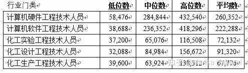
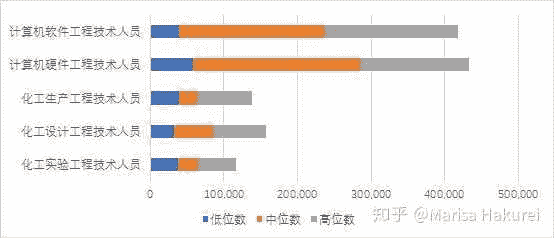
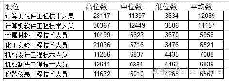

# 为什么很多大学生甚至研究生抛弃专业去做码农呢？

> 作者：[Marisa Hakurei](https://www.zhihu.com/question/21666262/answer/430250493)

广州市对2017年全市劳动者工资统计中，互联网制造业从业者与化工类制造业从业者的工资对比如下：

绘制成图表，更加明显：

看到了吗，什么叫做差距？这就叫差距。

图中蓝条和橙条的分界线为低位数，橙条和灰条的分界线为中位数，灰条的顶端为高位数。

考虑到高位数的定义是前10%的平均值，因此高位数工资对应的排位是10%以内。换言之，能拿到高位数工资的人，意味着他至少进入了这个行业的前10%。而中位数对应的排位是50%，即拿到这个数的人，在行业内正好位于50%的排位。

结合图表，我们可以得出一个难以置信的结论：

化工类技术人员工资的高位数，远不如计算机类专业人员工资的中位数。

这说明什么？假如你读了某知名985的化学专业，毕业后去做了化工技术人员（实际上化学跟化工还是有区别的，不少化学专业的人找化工工作都很吃力），你有着高学历，工作刻苦，又有贵人相助，忙活了多年，终于爬到了这个行业的前10%，傲视众人。

然后你发现，你到手的工资，还不及隔壁一个平庸码农的工资。

哦不对，从图里看，应该是还不及这个平庸码农工资的一半。

请问此时的你是什么感受？

不排除有人安贫乐道，但更多的人会失望，后悔，不平……他们中的一部分开始自救转行，并且在mitbbs上，在人人上，在知乎上劝退；另一部分人不会在网上发声，只会在亲戚家的高三孩子过来咨询专业时委婉地劝诫他们；而更多的人，连声音都懒得发了，只会把自己的心思深深地埋藏起来，就着倒班结束时的朝霞一口吞下。

这顺带说明一点：指望生化类工作越老越吃香是很不靠谱的：你如果转不到管理岗，大概率是干到老也只能拿那么一点工资……而如果转管理岗那么容易，隔壁的CS也不会隔三差五把中年危机拿出来说事了。

即使把统计口径不同，统计工资较低但职责类似的“计算机程序设计员”这一职业考虑进来，码农工作的薪资也是完爆化工技术人员的。

必须提到的一点是，这里的计算机技术人员指的是身处“计算机、通信和其他电子设备制造业”中的技术人员，而不是我们常说的软件服务业人员。由于广州缺乏大体量的互联网公司，因此软件服务业人员的中位数薪资没这么高。

但在旁边的深圳，情况则恰巧翻了过来：制造业里的码农薪资一般，而软件服务业公司中的码农则能拿到很多钱。

还是类似的，码农们的工资中位数赶上了大多数制造业人员的工资高位数。唯一值得庆幸的是，化工技术人员通过努力，如果做到行业前10%，工资终于能超过前50%的码农了呢！真是可喜可贺！

为什么很多大学生甚至研究生抛弃专业去做码农呢？

因为他们发现，只要努力几年转个行，一毕业拿到的工资就能赶得上他们在本行业奋斗几年（甚至十几年，几十年）得到的薪水。

既然如此，为什么不转呢？

----

补充

广州：

制造业里的码农工资远超化工等专业人员，

软件服务业里的码农工资跟化工等专业人员持平；

深圳：软件服务业里的码农工资远超化工等专业人员，

制造业里的码农工资跟化工等专业持平。

这个现象很有趣，也值得研究。

但是我今天就说说影响。

如果你是珠三角的码农，

想在制造业发展，你大可以去广州，广州有oppo，vivo，魅族等企业；（评论区补充：最后一句有错，这三家都不在广州。。。至于为啥制造业这么高我也很好奇）

想在软件服务业发展，你大可以去深圳，深圳除了大腾讯，还有迅雷等企业，很多大厂也在那边有岗。

选择对了，你总能拿到较多的钱

但是你如果学生化材环，这俩城市怎么跳都是那么点钱。。。

所以珠三角一带很多生化材环的学生转行，比如华南理工的材料学生转行率达到43%（凭记忆，可能有出入）。

其它大规模转行的地方，原因可能也差不多。

就是钱啊。